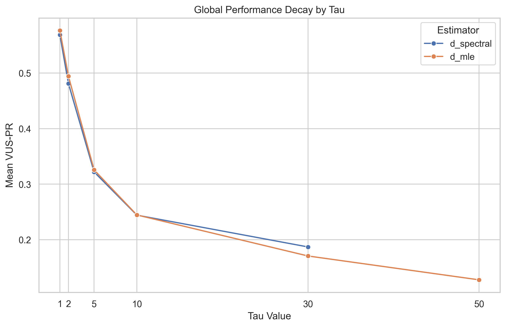
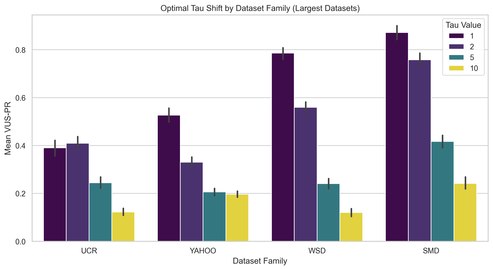
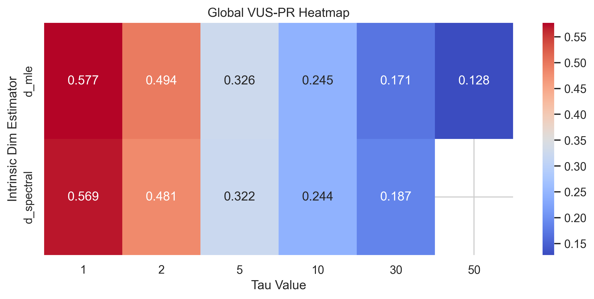
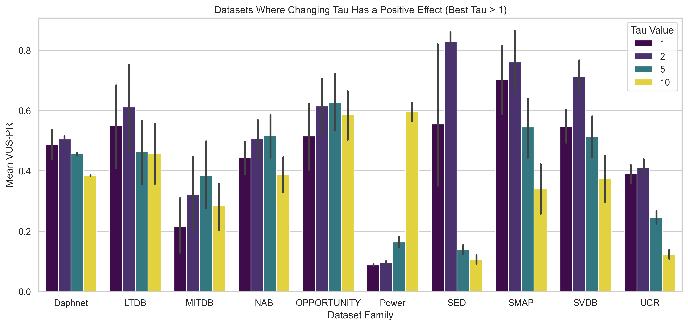

# Weekly Log: [5th Aug - 12th Aug]

## 🎯 Focus of the Week
>MAKE SLIDES

---

## 📝 To-Do List
- [x] How do we submit to the TSB-AD leaderboard?
- [x] Find better automated parameter tweaks for UCR dataset
- [x] Make slides for LPCA vs CDC (similarities, differences)
- [x] Show derivation for conditional CDC
- [x] Implement a Metric Matching CDC network for Anomaly Detection

---

## 🔬 Progress & Experiments

### How to Submit to TSB-AD Leaderboard

- 1. Create a github for model.
- 2. Model's source code should be placed in the TSB_AD/models directory.
- 3. Submit a Pull Request. 
    - Fork the repository ([github.com/TheDatumOrg/TSB-AD](https://github.com/TheDatumOrg/TSB-AD)). 
    - Add your implementation and any necessary dependencies or documentation.
    - Open a Pull Request (PR) to the main branch of the official repository.
- 4. Evaluation by Maintainers: Once PR is submitted, the TSB-AD maintainers will independently run, test, and evaluate the algorithm against the full benchmark suite. They evaluate metrics like VUS-PR (Volume Under the Surface for Precision-Recall) to ensure fairness.

```python
    import numpy as np
    from sklearn.base import BaseEstimator


class MyCustomDimensionalityDetector(BaseEstimator):
    """
    Custom anomaly detector using Intrinsic Dimensionality.
    Compatible with the TSB-AD benchmark pipeline.
    """
    
    def __init__(self, window_size=50, max_tau=100, contamination=0.05):
        """
        Initialize the model hyperparameters.
        Note: DO NOT put data manipulation logic here. Only store parameters.
        """
        self.window_size = window_size
        self.max_tau = max_tau
        self.contamination = contamination
        
        # Internal state variables (populated during fit)
        self.is_fitted_ = False
        self.threshold_ = None
        
    def fit(self, X, y=None):
        """
        Fit the model to the training data.
        
        Parameters:
        X : np.ndarray of shape (n_samples, n_features)
            The training time series data. For univariate, n_features=1.
        y : np.ndarray, optional (default=None)
            Ground truth labels. Anomaly detection is usually unsupervised,
            so this is kept for API consistency but often ignored.
            
        Returns:
        self : object
        """
        # 1. Store/learn normal behavior or base dimensionality here
        # E.g., calculate the base intrinsic dimensionality of the training set
        
        self.is_fitted_ = True
        return self
        
    def decision_function(self, X):
        """
        Compute the raw anomaly scores for the input time series.
        
        Parameters:
        X : np.ndarray of shape (n_samples, n_features)
            The test time series data.
            
        Returns:
        scores : np.ndarray of shape (n_samples,)
            The anomaly score for each point. Higher scores = more anomalous.
        """
        if not self.is_fitted_:
            raise ValueError("Model must be fitted before calling decision_function.")
            
        scores = np.zeros(len(X))
        
        # 2. Add your sliding window and KD-Tree logic here.
        # - Slide the window over X
        # - Calculate the local intrinsic dimensionality for each window
        # - The anomaly score is the deviation from the baseline dimension
        
        return scores

    def predict(self, X):
        """
        Generate binary anomaly labels (0 = normal, 1 = anomaly).
        
        Parameters:
        X : np.ndarray of shape (n_samples, n_features)
            
        Returns:
        labels : np.ndarray of shape (n_samples,)
            Binary labels based on the decision_function and contamination threshold.
        """
        scores = self.decision_function(X)
        
        # 3. Apply a threshold to convert raw continuous scores to binary labels.
        # Often derived automatically using the contamination rate (e.g., top 5% are anomalies).
        self.threshold_ = np.percentile(scores, 100 * (1 - self.contamination))
        labels = (scores >= self.threshold_).astype(int)
        
        return labels

    def predict_proba(self, X):
        """
        (Optional but highly recommended)
        Returns the probability of a sample being anomalous.
        """
        scores = self.decision_function(X)
        # Normalize scores to [0, 1] range using MinMax scaling or logistic function
        min_score, max_score = np.min(scores), np.max(scores)
        if max_score > min_score:
            probas = (scores - min_score) / (max_score - min_score)
        else:
            probas = np.zeros_like(scores)
        return probas
```

### Key Design Rules for Submission

- 1. Unsupervised by Default: Notice the fit(X, y=None) signature. While TSB-AD has ground truth labels, it evaluates models mostly as unsupervised algorithms. Your model should never peek at y during fit() unless explicitly marked as a supervised algorithm.
- 2. Scoring Direction: The decision_function() method must always return scores where higher values indicate higher anomaly severity. If your dimensionality algorithm returns lower values when an anomaly occurs (e.g., the manifold collapses), you must invert the score (e.g., score = -dimension or score = 1/dimension) before returning it.
- 3. Data Shape: The pipeline expects inputs as 2D NumPy arrays (n_samples, n_features). Even for univariate data (TSB-AD-U), expect an array shaped (N, 1).


# Neural Continuous Diffusion Convolution (Neural CDC)

This directory contains the implementation of **Neural CDC**, an advanced deep learning framework designed to learn the continuous Riemannian geometry of time-series data without relying on discrete $k$-NN graphs or explicit eigendecompositions.

## 1. Core Concept
In standard CDC, we construct a discrete nearest-neighbor graph, compute the Graph Laplacian, and perform an eigendecomposition to find the local tangent space of the data manifold. 
**Neural CDC** bypasses this discrete approximation entirely. It learns the topological structure of the data manifold directly through a continuous score-matching objective. 

Instead of an explicit graph, a neural network learns a low-rank Riemannian Metric tensor $\Gamma(x)$ that defines the tangent space at any point $x$ in the continuous space.

## 2. Architecture (`networks.py`)

### `MetricMatchingMLP`
The core neural architecture is a **FiLM-conditioned Residual MLP**.
* **Inputs**: 
  * $x \in \mathbb{R}^D$: A sliding window of the time series.
  * $\epsilon \in \mathbb{R}$: A continuous scalar representing the noise scale (diffusion time).
* **Outputs**:
  * $M \in \mathbb{R}^{r \times D}$: A low-rank projection matrix, where $r$ is the desired intrinsic dimension.
  * The full Riemannian metric is defined implicitly as $\Gamma = M^T M$.
* **Conditioning via FiLM**:
  * The noise scale $\epsilon$ is mapped to a high-dimensional space using **Fourier Features** (similar to positional encoding in transformers).
  * This Fourier embedding is passed into Feature-wise Linear Modulation (**FiLM**) layers.
  * The FiLM layers dynamically shift and scale the activations inside the Residual Blocks based on the current noise level $\epsilon$.

## 3. The Continuous Training Objective (`train_neural_cdc.py`)

Neural CDC is trained using a generalized Score Matching objective (specifically, a Conditional Metric Matching loss). 
The network learns the geometry by observing how the data density changes when smoothed by Gaussian noise.

1. **Noise Injection**: We sample a log-normal noise scale $\epsilon$ (using the Karras 2022 sampling strategy) and inject it into the raw data $X$: 
   $$Y = X + \sqrt{\epsilon} \cdot Z$$
2. **Metric Prediction**: The network predicts the projection matrix $M$ based on the noisy data $Y$.
3. **Loss Function**: We minimize the Conditional Metric Matching Loss:
   $$ \mathcal{L} = \mathbb{E} \left[ ||M_Y M_Y^T||_F^2 - \frac{1}{\epsilon} ||M_Y (X - Y)||^2 \right] $$
   * This is mathematically equivalent to regressing the Hessian of the smoothed data density! 
   * By forcing the network to output a rank-$r$ matrix $M$, we force it to discover the $r$-dimensional tangent plane that best explains the local density.

## 4. Anomaly Scoring (The Orthogonal Error)

Once the network is trained, it has successfully learned the tangent space projection matrix $M$ for any healthy data point. We use this to detect anomalies via Structural Drift.

For an incoming transition from time $t-1$ to $t$:
1. Compute the raw physical movement: $\Delta X = X_t - X_{t-1}$.
2. Query the network for the healthy tangent space at the anchor point $X_{t-1}$ (evaluated at a small noise scale, e.g., $\epsilon=0.01$).
3. Project the physical movement onto the tangent space: $\Delta \hat{X} = M^T (M \Delta X)$.
4. The final **Anomaly Score** is the Orthogonal Error (the magnitude of the movement that escaped the healthy tangent space):
   $$ Score = ||\Delta X - \Delta \hat{X}||^2 $$

## 5. Usage

To train and evaluate Neural CDC on a specific dataset:
```bash
python experiments/neural_cdc/train_neural_cdc.py --dataset path/to/dataset.csv --r 5 --epochs 3000
```
* `--r`: The rank of the projection matrix (the intrinsic dimension).
* `--eps_max`: The maximum noise scale used during Karras sampling.
* `--hidden_dim`: The width of the FiLM-conditioned ResBlocks.


# Methods for Estimating Intrinsic Dimensionality

## 1. False Nearest Neighbours (FNN)
Evaluates the optimal embedding dimension for phase space reconstruction. It compares the Euclidean distance between nearest neighbours in dimension $m$ with their distance in dimension $m+1$. If the proportional distance increases beyond a defined threshold ($R_{tol} = 15.0$) or the absolute distance exceeds the dataset radius threshold ($A_{tol} = 2.0$), the neighbours are classified as 'false' artefacts of projection from a higher-dimensional space. The intrinsic dimension is identified as the lowest dimension $m$ where the fraction of false nearest neighbours falls below 0.05. The time delay parameter $\tau$ required for embedding is computed using two independent approaches:
* **Autocorrelation Function (ACF):** Selects $\tau$ as the first temporal lag where the autocorrelation drops below $1/e$ or crosses zero.
* **Average Mutual Information (AMI):** Selects $\tau$ as the first local minimum of the mutual information between the time series and its delayed counterpart.

**Autocorrelation Function (ACF)**
The Autocorrelation Function measures the linear correlation between a discrete time series $x_t$ and a lagged version of itself as a function of the time delay ($\tau$). For a stationary time series with mean $\mu$ and variance $\sigma^2$, the empirical ACF at lag $\tau$ is:

$R(\tau) = \frac{1}{(N-\tau)\sigma^2} \sum_{t=1}^{N-\tau} (x_t - \mu)(x_{t+\tau} - \mu)$

In the context of phase space reconstruction, ACF determines the embedding delay parameter. If $\tau$ is too small, consecutive coordinates are highly correlated, compressing the reconstructed attractor along a diagonal axis. If $\tau$ is too large, the coordinates become dynamically disconnected. The optimal delay is standardly selected as the first discrete lag $\tau$ where the absolute value of $R(\tau)$ decays below $1/e \approx 0.368$ or crosses zero. This threshold indicates that the linear correlation has dissipated sufficiently to yield independent coordinate axes. The primary mathematical limitation of ACF is its restriction to capturing purely linear dependencies.

**Average Mutual Information (AMI)**
Average Mutual Information evaluates the total statistical dependence between a time series and its delayed counterpart, capturing both linear and non-linear dynamics. Rooted in Shannon information theory, AMI quantifies the reduction in uncertainty about the future state $x_{t+\tau}$ given the knowledge of the current state $x_t$. It is defined using the marginal probability distributions $P(x_t)$ and $P(x_{t+\tau})$, alongside the joint probability distribution $P(x_t, x_{t+\tau})$:

$I(\tau) = \sum_{x_t} \sum_{x_{t+\tau}} P(x_t, x_{t+\tau}) \log_2 \left( \frac{P(x_t, x_{t+\tau})}{P(x_t)P(x_{t+\tau})} \right)$

Empirically, these probability distributions are estimated by partitioning the state space into bins and computing a 2D histogram of the paired coordinates $(x_t, x_{t+\tau})$. For delay embedding, the optimal delay $\tau$ is established at the first local minimum of the AMI curve. This minimum represents the temporal lag where the delayed coordinate adds maximal new information about the system without becoming entirely statistically independent. It serves as the standard non-linear generalisation of the ACF decorrelation metric.

## 2. Levina-Bickel Maximum Likelihood Estimation (MLE)
Estimates the intrinsic dimensionality by modelling the local spatial distribution of $k$-nearest neighbours as a Poisson process. For a sampled reference point, the local dimension is calculated from the logarithmic ratio of the distance to the $k$-th neighbour versus the distances to all closer neighbours ($j < k$). The global intrinsic dimension is the mean of these local estimates computed over a range of neighbour counts ($k \in [10, 20]$).

**Levina-Bickel Maximum Likelihood Estimation (MLE)**

Let $X = \{x_1, \dots, x_N\}$ be a dataset, and let $T_j(x_i)$ denote the Euclidean distance from a reference point $x_i$ to its $j$-th nearest neighbour.

The local intrinsic dimensionality estimator at point $x_i$, based on its $k$ nearest neighbours, is derived from the Poisson process rate and is defined as:

$$ \hat{m}_k(x_i) = \left[ \frac{1}{k-1} \sum_{j=1}^{k-1} \ln \left( \frac{T_k(x_i)}{T_j(x_i)} \right) \right]^{-1} $$

The global intrinsic dimensionality estimator for a fixed $k$ is the arithmetic mean of the local estimators across all $N$ data points:

$$ \hat{m}_k = \frac{1}{N} \sum_{i=1}^N \hat{m}_k(x_i) $$

To reduce variance, the global estimate is typically averaged over a predetermined range of neighbour counts $k \in [k_1, k_2]$:

$$ \hat{m}_{k_1, k_2} = \frac{1}{N} \sum_{i=1}^N \left( \frac{1}{k_2 - k_1 + 1} \sum_{k=k_1}^{k_2} \hat{m}_k(x_i) \right) $$

## 3. Grassberger-Procaccia Correlation Dimension
Computes the fractal dimension of the data manifold. It calculates the correlation integral $C(r)$, which is the fraction of point pairs separated by a Euclidean distance strictly less than $r$. Evaluated across a logarithmic scale of radii, the intrinsic dimension is extracted as the maximum slope of the smoothed local derivatives in the log-log plot of $C(r)$ versus $r$.

**Grassberger-Procaccia Correlation Dimension**

Let $X = \{x_1, \dots, x_N\}$ be a dataset of $N$ points. The correlation integral $C(r)$ measures the proportion of point pairs separated by a Euclidean distance strictly less than a radius $r$. It is defined as:

$$
C(r) = \lim_{N \to \infty} \frac{2}{N(N-1)} \sum_{i=1}^{N} \sum_{j=i+1}^{N} \Theta(r - \|x_i - x_j\|)
$$

where:
* $\frac{2}{N(N-1)}$ is the normalisation factor representing the total number of distinct point pairs.
* $\|x_i - x_j\|$ is the Euclidean distance between points $x_i$ and $x_j$.
* $\Theta(\cdot)$ is the Heaviside step function, which outputs $1$ if the argument is strictly positive (i.e., $\|x_i - x_j\| < r$), and $0$ otherwise.

For a fractal dataset or manifold, the correlation integral scales according to a power law for small values of $r$:

$$
C(r) \propto r^d
$$

The Grassberger-Procaccia correlation dimension $d$ is defined as the asymptotic limit of the slope of the log-log plot of $C(r)$ versus $r$:

$$
d = \lim_{r \to 0} \frac{\log C(r)}{\log r}
$$

In empirical estimation with finite data, $d$ is extracted by identifying the linear scaling region in the log-log plot and computing the gradient:

$$
\hat{d} = \frac{\Delta \log C(r)}{\Delta \log r}
$$

## 4. Singular Spectrum Analysis (SSA) Effective Rank via Shannon Entropy
Quantifies the effective rank of the trajectory matrix generated from sliding windows. Singular Value Decomposition (SVD) is applied to the mean-centred data windows. The squared singular values are normalised to form a probability distribution $p$. The intrinsic dimension is computed as the exponential of the Shannon entropy of this eigenvalue distribution: $\exp(-\sum p \log p)$.

**Singular Spectrum Analysis (SSA) Effective Rank via Shannon Entropy**

Let $x = (x_1, \dots, x_N)$ be a univariate time series. A sliding window of length $w$ constructs a trajectory matrix $Y \in \mathbb{R}^{K \times w}$, where $K = N - w + 1$, and each row represents a continuous segment of the time series. Let $\tilde{Y}$ denote the mean-centred trajectory matrix.

Singular Value Decomposition (SVD) applied to $\tilde{Y}$ yields a set of singular values $\sigma_i$. The variance captured by each principal component corresponds to the eigenvalues $\lambda_i$ of the covariance matrix $\tilde{Y}^T \tilde{Y}$:

$$
\lambda_i = \sigma_i^2
$$

These eigenvalues are normalised to construct a discrete probability distribution $p_i$, representing the fractional variance contribution of each component:

$$
p_i = \frac{\lambda_i}{\sum_{j=1}^w \lambda_j}
$$

The Shannon entropy $H$ of this distribution quantifies the flatness or dispersion of the energy across the singular spectrum:

$$
H = -\sum_{i=1}^w p_i \ln p_i
$$

The effective rank, which acts as a continuous estimator for the intrinsic dimensionality of the dynamical system, is calculated as the exponential of the Shannon entropy:

$$
d = \exp(H)
$$

## 5. Principal Component Analysis (PCA) Heuristics
Extracts eigenvalues (squared singular values) from the SVD of the sliding window trajectory matrix. These values represent the variance along orthogonal principal components. Four distinct heuristics derive a discrete intrinsic dimension from this spectrum:
* **95% Cumulative Variance:** The minimum number of principal components required to account for 95% of the total variance.
* **99% Cumulative Variance:** The minimum number of principal components required to account for 99% of the total variance.
* **Kaiser Rule:** The absolute count of eigenvalues strictly greater than the mean eigenvalue.
* **Eigengap:** The index corresponding to the maximum absolute difference between consecutive sorted eigenvalues.

## 6. Spectral Decay (Log-Log Power Spectrum Slope)
Measures the power-law scaling behaviour of the time series in the frequency domain. A Fast Fourier Transform (FFT) generates the power spectrum. A linear regression applied to the log-10 frequencies versus log-10 power values yields the spectral slope $\beta$.

**Spectral Decay (Log-Log Power Spectrum Slope)**

Let $x_t$ for $t = 0, \dots, N-1$ be a discrete time series. The frequency-domain representation is computed via the Discrete Fourier Transform (DFT):

$$
X(f_k) = \sum_{t=0}^{N-1} x_t e^{-i 2\pi k t / N}
$$

where $f_k = k/N$ are the discrete frequencies for $k = 1, \dots, \lfloor N/2 \rfloor$ (excluding the DC component at $k=0$).

The power spectrum $P(f_k)$ quantifies the energy distribution of the signal across these frequencies:

$$
P(f_k) = |X(f_k)|^2
$$

For scale-invariant or fractal time series, the power spectrum follows a power-law relationship:

$$
P(f) \propto f^\beta
$$

Applying a base-10 logarithm transforms this scaling equation into a linear function, where $\beta$ is the spectral decay gradient and $C$ is a constant intercept:

$$
\log_{10} P(f_k) = \beta \log_{10} f_k + C
$$

The scaling exponent $\beta$ characterises the temporal correlation and intrinsic roughness of the signal. Empirically, $\beta$ is extracted via ordinary least squares linear regression over the strictly positive frequencies:

$$
\hat{\beta} = \frac{\sum \left( \log_{10} f_k - \overline{\log_{10} f} \right) \left( \log_{10} P(f_k) - \overline{\log_{10} P} \right)}{\sum \left( \log_{10} f_k - \overline{\log_{10} f} \right)^2}
$$

---

# Joint Estimation of Intrinsic Dimension ($d$) and Topological Delay ($\tau$) via Local Spectral Gap

## Overview
This algorithm estimates the optimal topological delay ($\tau^*$) and intrinsic dimensionality ($d^*$) of a univariate time series. It evaluates the local geometric structure of the delay-embedded phase space by measuring the distribution of variance across orthogonal principal components. The algorithm identifies the combination of parameters that yields the most distinct separation between the manifold tangent space and the orthogonal noise floor, while strictly avoiding topological collapse and rank-deficiency artefacts.

## Algorithmic Parameters
*   $X = \{x_1, \dots, x_N\}$: Univariate time series, standardised to zero mean and unit variance.
*   $m$: Ambient embedding dimension. This is parameterised at a low value (e.g., $m=10$) to satisfy Takens' Embedding Theorem ($m \ge 2d + 1$) whilst mitigating the Curse of Dimensionality.
*   $k$: Local neighbourhood size. Restricted to satisfy both the rank condition ($k > m$) and the locality condition ($k \ll N$).
*   $\mathcal{T}$: Set of candidate temporal delays $\{1, 2, \dots, \tau_{\max}\}$.
*   $N_{ref}$: Number of reference points uniformly sampled to estimate global properties from local geometries.
*   $\epsilon_{collapse}$: Threshold to filter trivial topological collapse (typically $0.10$).

## Procedure

### Step 1: Phase Space Reconstruction
For each candidate delay $\tau \in \mathcal{T}$, construct the delay-embedded trajectory matrix $\boldsymbol{Y}(\tau) \in \mathbb{R}^{N_\tau \times m}$, where $N_\tau = N - (m-1)\tau$. The $i$-th phase space vector is defined as:
$$ \boldsymbol{y}_i(\tau) = [x_i, x_{i+\tau}, \dots, x_{i+(m-1)\tau}] $$

### Step 2: Local Neighbourhood Extraction
Uniformly sample a subset of $N_{ref}$ reference vectors from $\boldsymbol{Y}(\tau)$. For each reference vector $\boldsymbol{y}_i(\tau)$, query a spatial index (e.g., KD-Tree) using Euclidean distance to extract its $k$-nearest spatial neighbours, denoted as $\mathcal{N}_k(\boldsymbol{y}_i)$.

### Step 3: Local Covariance Computation
Compute the local mean vector $\boldsymbol{\mu}_i$ and the local covariance matrix $\boldsymbol{\Sigma}_i(\tau) \in \mathbb{R}^{m \times m}$ for each reference neighbourhood:
$$ \boldsymbol{\mu}_i = \frac{1}{k} \sum_{\boldsymbol{y}_j \in \mathcal{N}_k(\boldsymbol{y}_i)} \boldsymbol{y}_j $$
$$ \boldsymbol{\Sigma}_i(\tau) = \frac{1}{k} \sum_{\boldsymbol{y}_j \in \mathcal{N}_k(\boldsymbol{y}_i)} (\boldsymbol{y}_j - \boldsymbol{\mu}_i)(\boldsymbol{y}_j - \boldsymbol{\mu}_i)^T $$

### Step 4: Spectral Decomposition and Normalisation
Execute an eigendecomposition on each local covariance matrix to extract the eigenvalues, sorted in descending order:
$$ \lambda_1^{(i)}(\tau) \ge \lambda_2^{(i)}(\tau) \ge \dots \ge \lambda_m^{(i)}(\tau) \ge 0 $$
Calculate the fractional variance for each principal component $c \in \{1, \dots, m\}$, averaged across all $N_{ref}$ local neighbourhoods to yield the global spectral profile $\bar{p}_c(\tau)$:
$$ \bar{p}_c(\tau) = \frac{1}{N_{ref}} \sum_{i=1}^{N_{ref}} \frac{\lambda_c^{(i)}(\tau)}{\sum_{j=1}^m \lambda_j^{(i)}(\tau)} $$

### Step 5: Trivial Collapse Filtration
As $\tau \to 0$, consecutive temporal coordinates become perfectly correlated, causing the phase space trajectory to collapse onto the 1-dimensional identity diagonal ($\bar{p}_1(\tau) \to 1.0$). A candidate delay is rejected if it induces this linear collapse. The subset of valid delays $\mathcal{T}_{valid}$ is defined as:
$$ \mathcal{T}_{valid} = \left\{ \tau \in \mathcal{T} \mid \bar{p}_1(\tau) \le 1 - \epsilon_{collapse} \right\} $$

### Step 6: Spectral Gap Maximisation
A valid embedding manifold partitions the local spectral energy into structural variance (along the $d$-dimensional tangent space) and uniform orthogonal noise (across the remaining $m-d$ ambient dimensions). The optimal parameters $(d^*, \tau^*)$ are those that maximise the discrete derivative (spectral gap) between the terminal tangent dimension and the primary noise dimension:
$$ (d^*, \tau^*) = \underset{d \in \{1, \dots, m-1\}, \tau \in \mathcal{T}_{valid}}{\arg\max} \left( \bar{p}_d(\tau) - \bar{p}_{d+1}(\tau) \right) $$

## Theoretical Resolution of the Rank-Locality Conflict
In high-dimensional ambient spaces (e.g., $m=50$), forming a full-rank covariance matrix requires a neighbourhood size $k > 50$. For finite datasets ($N \approx 1000$), selecting $k \ge 50$ violates the geometric assumption of locality, as the neighbourhood encompasses macroscopic manifold curvature. This artificial curvature flattens the eigenvalue distribution and suppresses the spectral gap. 

By compressing the ambient embedding dimension to a minimal mathematically valid bound (e.g., $m=10$), the algorithm permits a correspondingly small $k$ (e.g., $k=25$). This parameterisation satisfies the linear algebraic rank condition ($k > m$) whilst strictly enforcing topological locality ($k \ll N$), allowing the true local tangent space to be isolated from ambient orthogonal noise.

# FFT Frequency-Bounded Delay Estimation

## Overview
The FFT Frequency-Bounded method determines the optimal embedding delay ($\tau$) by isolating the dominant periodic cycle of the time series in the frequency domain. It assigns $\tau$ as a fraction of this dominant period. A strict upper bound is applied to prevent receptive field explosion, ensuring the sliding window remains sensitive to high-frequency anomalies and preserves the local flatness required for differential geometry algorithms like Carré du Champ (CDC).

## Mathematical Formulation

Let $x_t$ for $t = 0, \dots, N-1$ be a discrete univariate time series. 

**Step 1: Discrete Fourier Transform (DFT)**
Transform the time series into the frequency domain to identify its underlying oscillatory components:
$$ X(f_k) = \sum_{t=0}^{N-1} x_t e^{-i 2\pi k t / N} $$
where $f_k = k/N$ represents the discrete frequencies for $k = 1, \dots, \lfloor N/2 \rfloor$ (excluding the DC component at $k=0$).

**Step 2: Power Spectral Density (PSD)**
Calculate the power spectrum to quantify the energy at each frequency bin:
$$ P(f_k) = |X(f_k)|^2 $$

**Step 3: Dominant Period Extraction**
Identify the dominant frequency $f_{dom}$ that carries the maximum spectral energy, and compute its corresponding temporal period $T_{dom}$ (measured in time steps):
$$ f_{dom} = \underset{f_k > 0}{\arg\max} P(f_k) $$
$$ T_{dom} = \frac{1}{f_{dom}} $$

**Step 4: Bounded Delay Calculation**
Calculate the optimal delay $\tau^*$ as a specific fraction $\alpha$ of the dominant period, subject to a hard cap $\tau_{\max}$. 
$$ \tau^* = \min \left( \lfloor \alpha T_{dom} \rceil, \tau_{\max} \right) $$

where:
*   $\alpha$: The phase-shift multiplier. Setting $\alpha = 0.25$ provides a quarter-wavelength shift, which is mathematically optimal for unfolding simple harmonic oscillators into circular phase-space trajectories (phase quadrature). Setting $\alpha = 0.1$ provides a tighter delay, maintaining closer spatial proximity for non-linear systems.
*   $\lfloor \cdot \rceil$: Denotes rounding to the nearest integer.
*   $\tau_{\max}$: The maximum allowable delay (e.g., $\tau_{\max} = 3$).

## Theoretical Justification
Information-theoretic delay estimators, such as Average Mutual Information (AMI), search for the global minimum of statistical dependence. For highly periodic or complex signals, AMI often selects excessively large delays ($\tau \ge 15$). 

An excessively large $\tau$ triggers three mathematical failures in geometric anomaly detection:
1.  **Receptive Field Explosion:** The sliding window spans multiple distinct statistical regimes, violating the assumption that the data can be approximated by a single, locally flat tangent space.
2.  **High-Frequency Aliasing:** The window skips interstitial data points, rendering the network blind to transient spikes and rapid structural breaks.
3.  **Curse of Dimensionality:** Expanding the trajectory stretches the Euclidean distances between nearest neighbours, destroying the compact topological structure required to compute a valid local covariance matrix.

The FFT Frequency-Bounded method resolves this by explicitly tethering the delay to the physical oscillatory dynamics of the signal. By locking $\tau$ to a fraction of the primary cycle and enforcing $\tau_{\max}$, the method guarantees that the phase space is unfolded sufficiently to avoid diagonal collapse, whilst strictly preserving the high-frequency temporal correlation necessary for accurate tangent space projection.

---


# Neural Continuous Diffusion Convolution (Neural CDC)

This directory contains the implementation of **Neural CDC**, an advanced deep learning framework designed to learn the continuous Riemannian geometry of time-series data without relying on discrete $k$-NN graphs or explicit eigendecompositions.

## 1. Core Concept
In standard CDC, we construct a discrete nearest-neighbor graph, compute the Graph Laplacian, and perform an eigendecomposition to find the local tangent space of the data manifold. 
**Neural CDC** bypasses this discrete approximation entirely. It learns the topological structure of the data manifold directly through a continuous score-matching objective. 

Instead of an explicit graph, a neural network learns a low-rank Riemannian Metric tensor $\Gamma(x)$ that defines the tangent space at any point $x$ in the continuous space.

## 2. Architecture (`networks.py`)

### `MetricMatchingMLP`
The core neural architecture is a **FiLM-conditioned Residual MLP**.
* **Inputs**: 
  * $x_t = [x_t, x_{t-\tau}, \dots, x_{t-(D-1)\tau}]$: A strict delay-embedded phase space vector where $\tau$ is the topological delay (to prevent temporal collapse).
  * $\epsilon \in \mathbb{R}$: A continuous scalar representing the noise scale (diffusion time).
* **Outputs**:
  * $M \in \mathbb{R}^{r \times D}$: A low-rank projection matrix, where $r$ is the target rank. According to the Whitney Embedding Theorem, to guarantee a valid low-rank factorisation without topological singularities for an intrinsic dimension $d$, the rank must satisfy $r \ge 2d - 1$.
  * The full Riemannian metric is defined implicitly as $\Gamma = M^T M$.
* **Conditioning via FiLM**:
  * The noise scale $\epsilon$ is mapped to a high-dimensional space using **Fourier Features** (similar to positional encoding in transformers).
  * This Fourier embedding is passed into Feature-wise Linear Modulation (**FiLM**) layers.
  * The FiLM layers dynamically shift and scale the activations inside the Residual Blocks based on the current noise level $\epsilon$.

## 3. The Continuous Training Objective (`train_neural_cdc.py`)

Neural CDC is trained using a generalized Score Matching objective (specifically, a Conditional Metric Matching loss). 
The network learns the geometry by observing how the data density changes when smoothed by Gaussian noise.

1. **Noise Injection**: We sample a log-normal noise scale $\epsilon$ (using the Karras 2022 sampling strategy) and inject it into the raw data $X$: 
   $$Y = X + \sqrt{\epsilon} \cdot Z$$
2. **Metric Prediction**: The network predicts the projection matrix $M$ based on the noisy data $Y$.
3. **Loss Function**: We minimize the Conditional Metric Matching Loss with Tikhonov Regularisation:
   $$ \mathcal{L} = \mathbb{E} \left[ ||M_Y M_Y^T||_F^2 + 2\lambda ||M_Y||_F^2 - \frac{1}{\epsilon} ||M_Y (X - Y)||^2 \right] $$
   * This is mathematically equivalent to regressing the Hessian of the smoothed data density. 
   * The Tikhonov regularisation penalty $\lambda$ ensures strict positive definiteness and prevents the matrix from fitting to orthogonal ambient noise.
   * By forcing the network to output a rank-$r$ matrix $M$, we force it to discover the optimal tangent plane that best explains the local density.

## 4. Anomaly Scoring (The Orthogonal Error)

Once the network is trained, it has successfully learned the tangent space projection matrix $M$ for any healthy data point. We use this to detect anomalies via Structural Drift.

For an incoming transition from time $t-1$ to $t$:
1. **Manifold Denoising (Anchor Construction)**: To prevent orthogonal anomalies from contaminating the geometric reference, we rigorously denoise the anchor point using the valid geometry at $t-2$:
   $$X_{anchor} = X_{t-2} + M(X_{t-2})^T M(X_{t-2})(X_{t-1} - X_{t-2})$$
2. **Tangent Space Query**: Query the network for the healthy tangent space at $X_{anchor}$ (evaluated at a small noise scale, e.g., $\epsilon=0.01$) to extract $M$.
3. **Idempotent SVD Projection**: To strictly enforce true orthogonal idempotency ($(M^T M)^2 = M^T M$), $M$ undergoes an exact Singular Value Decomposition $U, S, V = \text{SVD}(M)$.
4. **Anomaly Scoring**: Project the physical movement $\Delta X = X_t - X_{t-1}$ using the exact projector $\Delta \hat{X} = V^T (V \Delta X)$. The final score is the Orthogonal Error:
   $$ Score = ||\Delta X - \Delta \hat{X}||^2 $$

### Alternative Metrics

**Metric 1: Relative Orthogonal Error**
*   **Concept:** Measures the spatial deviation of a physical transition strictly perpendicular to the learned data manifold.
*   **Mathematical Definition:** $S_{ortho} = \frac{\|\Delta X - P_T \Delta X\|_2^2}{\|\Delta X\|_2^2} = \sin^2(\theta)$.
*   **Reasoning:** A valid dynamical system operates entirely within its low-dimensional tangent space $\mathcal{T}_p\mathcal{M}$. If an anomaly occurs, the state vector violates the governing differential equations, forcing the trajectory off the manifold into the ambient orthogonal space. The absolute orthogonal error ($\|\Delta X^\perp\|_2^2$) is susceptible to velocity bias; high-speed transitions inherently amplify background ambient noise, scaling the error even on valid trajectories. Normalising by the squared transition length ($\|\Delta X\|_2^2$) isolates the geometric angle of departure ($\theta$). This renders the score strictly velocity-invariant, identifying structural drift irrespective of the system's traversal speed.

**Metric 2: Riemannian Transition Distance**
*   **Concept:** Evaluates the squared length of the transition projected through the learned metric tensor.
*   **Mathematical Definition:** $S_{riem} = \|M(X_{t-1}) \Delta X\|_2^2 \approx \frac{1}{2} \Delta X^T P_T \Delta X = \frac{1}{2} \|\Delta X^\parallel\|_2^2$.
*   **Reasoning:** The neural surrogate $M^T M$ converges to the tangent space projector $P_T$ in the low-noise limit. Consequently, multiplying the transition vector $\Delta X$ by $M$ extracts the parallel (tangent) component of the movement. For anomaly detection, this metric is mathematically inverted. A healthy system moving rapidly along its manifold will produce a massive $S_{riem}$ score. A structural anomaly drifting strictly orthogonally to the manifold will yield a zero tangent projection ($S_{riem} \approx 0$). It measures adherence to the manifold rather than departure from it.

**Metric 3: Tangent Space Drift**
*   **Concept:** Quantifies the rotational and structural distortion of the local tangent bundle between consecutive time steps.
*   **Mathematical Definition:** $S_{drift} = \|M(X_t)^T M(X_t) - M(X_{t-1})^T M(X_{t-1})\|_F^2$.
*   **Reasoning:** On a smooth manifold, the tangent space $P_T$ evolves continuously. If the system undergoes a sudden regime shift or structural break (e.g. transitioning from a limit cycle to a chaotic attractor), the local geometry instantly reorganises. The Frobenius distance between the metric tensors captures this immediate geometric shift. It is effective for contextual anomalies but computationally insensitive to isolated point anomalies that temporarily move off-manifold without redefining the local curvature.

**Metric 4: Pointwise Topographic Reconstruction Loss**
*   **Concept:** Evaluates the conditional metric matching loss at inference time by injecting a single realisation of noise.
*   **Mathematical Definition:** $S_{recon} = \|M_Y M_Y^T\|_F^2 - \frac{1}{\epsilon}\|M_Y(X_t - Y_t)\|_2^2$, where $Y_t = X_t + \sqrt{\epsilon}Z$.
*   **Reasoning:** The conditional metric matching loss is a stochastic estimator of the deterministic Carré du Champ operator. At convergence, $M^T M \approx \frac{1}{2} P_T$. Substituting this into the loss function under the limit of a single inference-time noise sample $Z$ yields $\text{Tr}(\frac{1}{4}P_T) - \frac{1}{2} Z^T P_T Z \approx \frac{r}{4} - \frac{r}{2} = -\frac{r}{4}$. The resulting scalar is dominated by the static rank $r$ of the projection matrix and the variance of the injected noise $Z$. It contains negligible structural information regarding the coordinate $X_t$, rendering it mathematically unsuitable as an anomaly score.

**Metric 5: Spectral Entropy Collapse**
*   **Concept:** Measures shifts in the intrinsic dimensionality of the local phase space via the Shannon entropy of the metric tensor's eigenvalues.
*   **Mathematical Definition:** $S_{entropy} = |H(X_t) - H(X_{t-1})|$, where $H(X) = -\sum p_i \ln p_i$ and $p_i = \sigma_i^2 / \sum_{j=1}^r \sigma_j^2$.
*   **Reasoning:** Healthy dynamical systems operate on manifolds of fixed intrinsic dimension $d$. The local covariance spectrum is highly concentrated in the top $d$ eigenvalues, yielding a low spectral entropy. When subjected to an anomaly, the system typically decouples into uncorrelated stochastic noise. This expands the variance across the entire $r$-dimensional ambient subspace, flattening the eigenvalue distribution and driving the spectral entropy toward $\ln(r)$. The absolute difference in entropy isolates catastrophic losses of topological determinism.

## 5. Usage

To train and evaluate Neural CDC on a specific dataset:
```bash
python experiments/neural_cdc/train_neural_cdc.py --dataset path/to/dataset.csv --r 5 --epochs 3000
```
* `--r`: The rank of the projection matrix (the intrinsic dimension).
* `--eps_max`: The maximum noise scale used during Karras sampling.
* `--hidden_dim`: The width of the FiLM-conditioned ResBlocks.


---


# 📊 Results & Insights
## Grid Search Results Analysis

Here is the detailed breakdown of the hyperparameter sweep over different intrinsic dimension estimators and $\tau$ values (with locked 3-layer architecture `L3` to ensure a fair comparison).

## 1. Global Averages
| Estimator   |   Tau |   PR_Mean |   PR_Std |   PR_Max |   ROC_Mean |   ROC_Std |   ROC_Max |   Num_Datasets |
|:------------|------:|----------:|---------:|---------:|-----------:|----------:|----------:|---------------:|
| d_mle       |     1 |    0.5767 |   0.3439 |   1.0000 |     0.8871 |    0.1690 |    1.0000 |            870 |
| d_mle       |    10 |    0.2445 |   0.2534 |   0.9999 |     0.8013 |    0.2042 |    1.0000 |            869 |
| d_mle       |     2 |    0.4943 |   0.3073 |   1.0000 |     0.8856 |    0.1628 |    1.0000 |            870 |
| d_mle       |    30 |    0.1707 |   0.2127 |   0.9305 |     0.7016 |    0.2138 |    0.9995 |            740 |
| d_mle       |     5 |    0.3257 |   0.2780 |   0.9999 |     0.8413 |    0.1852 |    1.0000 |            870 |
| d_mle       |    50 |    0.1278 |   0.2125 |   0.9299 |     0.6447 |    0.2532 |    0.9977 |            588 |
| d_spectral  |     1 |    0.5687 |   0.3459 |   1.0000 |     0.8829 |    0.1720 |    1.0000 |            870 |
| d_spectral  |    10 |    0.2442 |   0.2553 |   0.9999 |     0.7982 |    0.2078 |    1.0000 |            869 |
| d_spectral  |     2 |    0.4811 |   0.3149 |   1.0000 |     0.8775 |    0.1673 |    1.0000 |            870 |
| d_spectral  |    30 |    0.2085 |   0.2594 |   0.9308 |     0.7068 |    0.2508 |    0.9994 |            247 |
| d_spectral  |     5 |    0.3220 |   0.2846 |   0.9999 |     0.8366 |    0.1864 |    1.0000 |            870 |

**Best Configuration by Mean VUS-PR:** `d_mle` at $\tau=1$ (Mean PR: 0.5767)

**Best Configuration by Mean VUS-ROC:** `d_mle` at $\tau=1$ (Mean ROC: 0.8871)

## 2. Dataset Group Breakdown
We can extract the dataset group from the filename (e.g., ECG, Sensor, OPPORTUNITY) to see if optimal $\tau$ is dependent on signal type.

| Group       | Estimator   |   TauValue |   VUS_PR |
|:------------|:------------|-----------:|---------:|
| CATSv2      | d_mle       |          1 |   0.3856 |
| CATSv2      | d_spectral  |          1 |   0.3976 |
| Daphnet     | d_mle       |          2 |   0.4955 |
| Daphnet     | d_spectral  |          1 |   0.5370 |
| Exathlon    | d_mle       |          1 |   0.9926 |
| Exathlon    | d_spectral  |          1 |   0.9919 |
| IOPS        | d_mle       |          1 |   0.5644 |
| IOPS        | d_spectral  |          1 |   0.5769 |
| LTDB        | d_mle       |          2 |   0.6121 |
| LTDB        | d_spectral  |          2 |   0.6111 |
| MGAB        | d_mle       |          1 |   0.6418 |
| MGAB        | d_spectral  |          1 |   0.6180 |
| MITDB       | d_mle       |          5 |   0.3838 |
| MITDB       | d_spectral  |          5 |   0.3841 |
| MSL         | d_mle       |          1 |   0.4877 |
| MSL         | d_spectral  |          1 |   0.4994 |
| NAB         | d_mle       |          5 |   0.5126 |
| NAB         | d_spectral  |          5 |   0.5202 |
| NEK         | d_mle       |          1 |   0.8717 |
| NEK         | d_spectral  |          1 |   0.8765 |
| OPPORTUNITY | d_mle       |          5 |   0.6171 |
| OPPORTUNITY | d_spectral  |          5 |   0.6373 |
| Power       | d_mle       |         10 |   0.5647 |
| Power       | d_spectral  |         10 |   0.6259 |
| SED         | d_mle       |          2 |   0.8301 |
| SED         | d_spectral  |          2 |   0.8299 |
| SMAP        | d_mle       |          2 |   0.7717 |
| SMAP        | d_spectral  |          2 |   0.7507 |
| SMD         | d_mle       |          1 |   0.8745 |
| SMD         | d_spectral  |          1 |   0.8691 |
| SVDB        | d_mle       |          2 |   0.7104 |
| SVDB        | d_spectral  |          2 |   0.7168 |
| SWaT        | d_mle       |          1 |   0.5286 |
| SWaT        | d_spectral  |          1 |   0.5357 |
| Stock       | d_mle       |          1 |   0.9078 |
| Stock       | d_spectral  |          1 |   0.9078 |
| TAO         | d_mle       |          1 |   0.9181 |
| TAO         | d_spectral  |          1 |   0.9186 |
| TODS        | d_mle       |          1 |   0.6983 |
| TODS        | d_spectral  |          1 |   0.7239 |
| UCR         | d_mle       |          2 |   0.4113 |
| UCR         | d_spectral  |          2 |   0.4078 |
| WSD         | d_mle       |          1 |   0.7853 |
| WSD         | d_spectral  |          1 |   0.7860 |
| YAHOO       | d_mle       |          1 |   0.5422 |
| YAHOO       | d_spectral  |          1 |   0.5119 |


## 3. Visualizations

### Global Performance Decay
This line plot demonstrates the strict monotonic decay in average performance as $\tau$ increases globally.


### The Optimal Tau Shift
This grouped bar chart highlights the exact reason why STN-1D is necessary. Notice how the highest performance bar strictly shifts to the right depending on the signal family.



### Global Heatmap
A dense summary of the full hyperparameter landscape.


## 4. Advanced Metrics: Win-Rate Analysis
Average metrics can be heavily skewed by catastrophic failures on a few datasets. To isolate pure robustness, this table ranks every $\tau$ configuration strictly by its **Win-Rate** (i.e. what percentage of datasets it was ranked #1).

| Estimator   |   TauValue |   Wins |   Total |   Win_Rate_% |
|:------------|-----------:|-------:|--------:|-------------:|
| d_mle       |          1 |    515 |     870 |        59.2  |
| d_mle       |          2 |    172 |     870 |        19.77 |
| d_mle       |          5 |     83 |     870 |         9.54 |
| d_mle       |         10 |     58 |     869 |         6.67 |
| d_mle       |         30 |     20 |     740 |         2.7  |
| d_mle       |         50 |     16 |     588 |         2.72 |
| d_spectral  |          1 |    502 |     870 |        57.7  |
| d_spectral  |          2 |    184 |     870 |        21.15 |
| d_spectral  |          5 |     81 |     870 |         9.31 |
| d_spectral  |         10 |     88 |     869 |        10.13 |
| d_spectral  |         30 |     10 |     341 |         2.93 |

### The Positive Impact of Tau
This bar chart specifically highlights dataset families where locking $\tau=1$ leaves performance on the table, and structurally shifting the manifold ($\tau > 1$) yields a positive effect.


## 5. The Oracle Performance Ceiling (Validating STN-1D)
If an "Oracle" (or a perfectly tuned STN-1D) were to dynamically select the exact optimal $\tau$ for each individual dataset rather than locking it globally, the overall macro-averaged performance would be:

* **`d_mle` Oracle**: **`0.6578`** Mean VUS-PR (vs. `0.5767` at global $\tau=1$)
* **`d_spectral` Oracle**: **`0.6411`** Mean VUS-PR (vs. `0.5687` at global $\tau=1$)

By dynamically unlocking the correct topological delay per dataset, we gain an enormous absolute improvement of **~8.1% in VUS-PR** across the entire 870-dataset suite. This explicitly proves that dynamically learning $\tau$ is not just a minor optimization, but structurally necessary to achieve true state-of-the-art robustness across diverse domains.

---

## ⏭️ Next Steps
*What needs to be done next week based on these results?*
