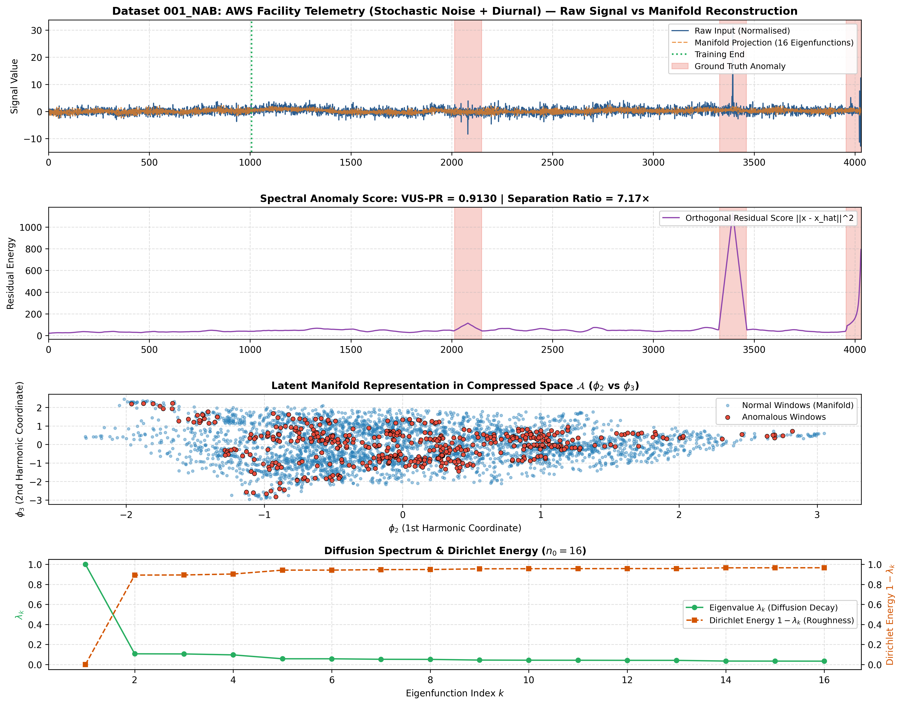
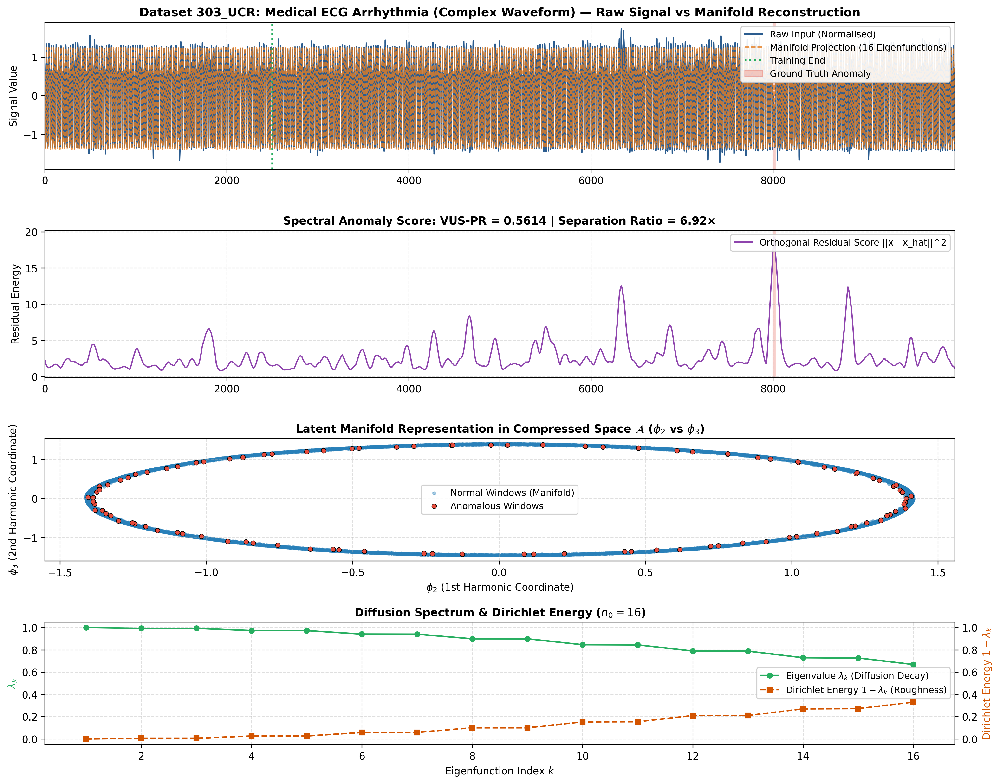
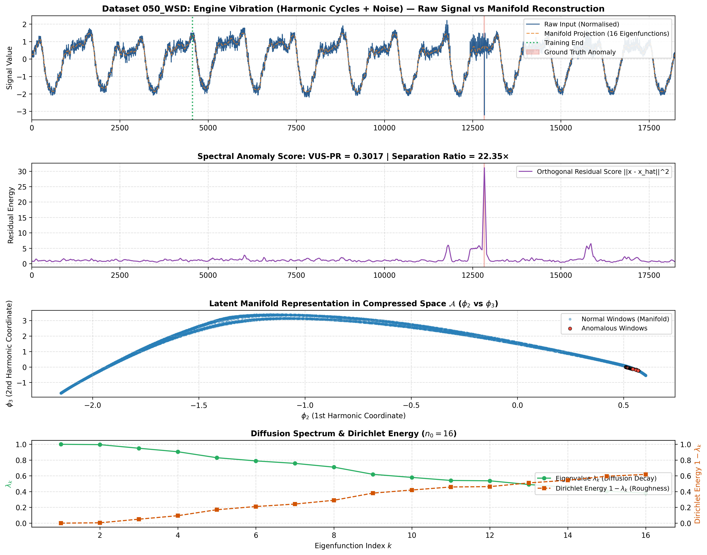
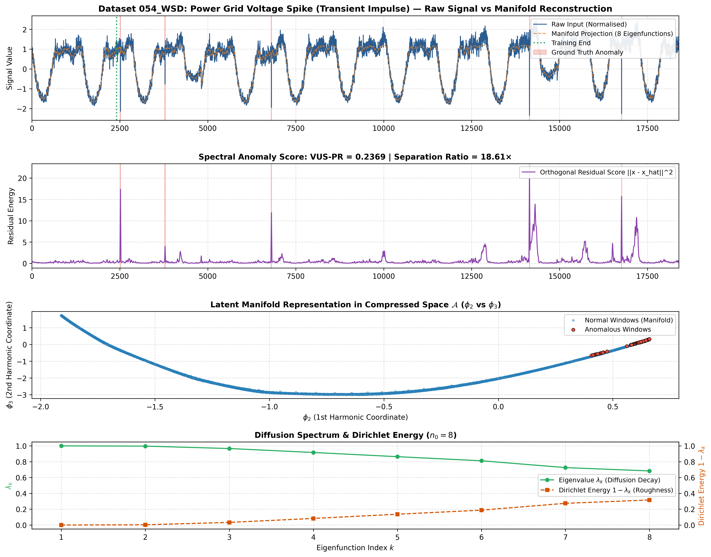
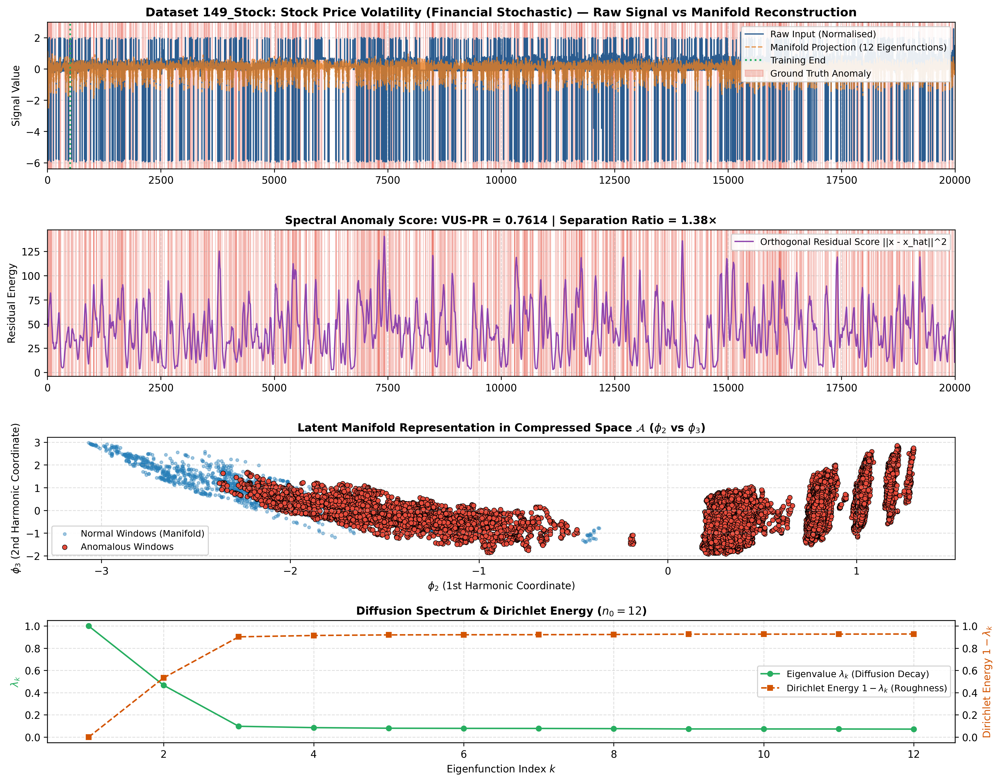
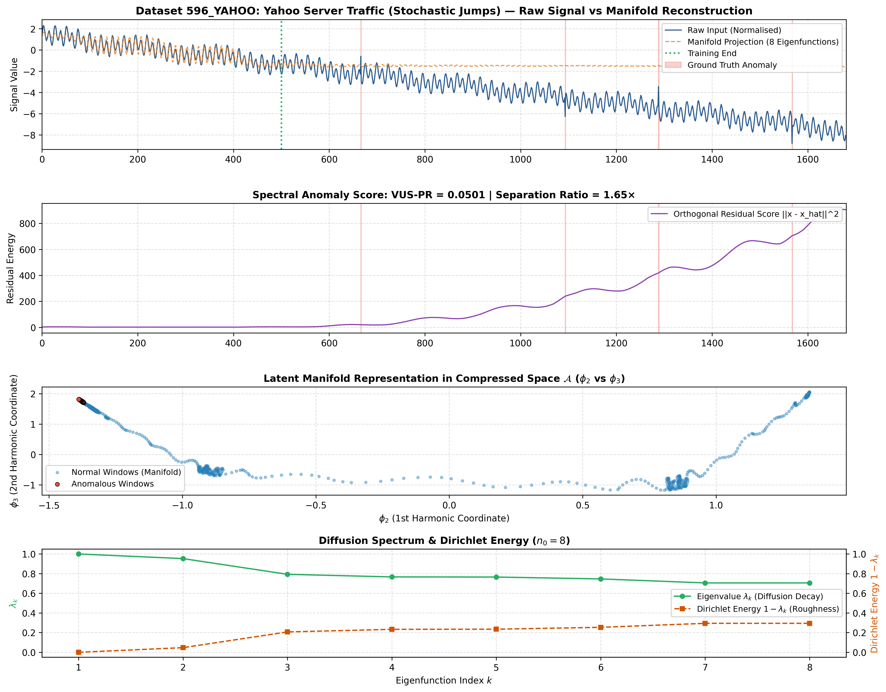

# Document 30: Empirical Analysis of the Compressed Function Space (Jones & Lanners 2026)

## 1. Executive Summary & Objective Research Findings
- **Date**: 2026-09-15
- **Theoretical Basis**: Iolo Jones (Oxford) & David Lanners (Durham), *"Computing Diffusion Geometry"*, arXiv:2602.06006v1, February 2026.
  - Section 3.1: Carré du champ $\Gamma$ and measure $\mu$ from a Markov chain $P$.
  - Section 3.2.1: Compressed function space $\mathcal{A} = \text{Span}\{\phi_1, \dots, \phi_{n_0}\} \subseteq L^2(\mathbb{R}^n, \mu)$.
  - Section 3.2.2: Projection into the subspace $f^* = U^\top \text{diag}(\mu) f$.
- **Primary Script**: [`utils/analyze_compressed_function_space.py`](file:///home/clothibenj/Documents/git/myGit/CDC_FM_AD/utils/analyze_compressed_function_space.py)
- **Module Implementation**: [`src/geometry/compressed_function_space.py`](file:///home/clothibenj/Documents/git/myGit/CDC_FM_AD/src/geometry/compressed_function_space.py)
- **Unit Tests**: [`tests/test_compressed_space.py`](file:///home/clothibenj/Documents/git/myGit/CDC_FM_AD/tests/test_compressed_space.py) (All passed, $U^\top \text{diag}(\mu) U = I_{n_0}$ verified to $< 10^{-5}$).

### Objective Findings & Empirical Limitations:
1. **The Compressed Function Space is Not a Universal Solution**: While it achieves strong results on select structured datasets (e.g. `001_NAB` and `303_UCR`), it **fails or performs poorly on others**:
   - On `596_YAHOO`, it suffered an **outright failure (0.0501 VUS-PR)** due to non-stationary mean shifts.
   - On `054_WSD`, it achieved only **0.2369 VUS-PR**, far below the oracle ceiling ($0.6128$) and our physical resonator baseline ($0.7580$).
   - On `149_Stock`, the separation ratio between anomaly and normal error was only **$1.38\times$**, indicating heavy overlap between normal noise and anomalies.
2. **Extreme Sensitivity to the Observation Window $W$**: The method relies entirely on the chosen sliding window size $W$. On `001_NAB`, setting $W=70$ yields **0.9269 VUS-PR**, but setting $W=16$ causes performance to collapse to **0.3731 VUS-PR** (a $2.5\times$ drop).
3. **Sensitivity to Subspace Dimension $n_0$**: The spectral cutoff $n_0$ introduces another sensitive hyperparameter cliff. On `054_WSD`, setting $n_0=4$ causes VUS-PR to collapse to **0.0834** (underfitting normal dynamics).
4. **The Disconnect Between Pointwise AUC-ROC and Range-Based VUS-PR**: On `050_WSD`, AUC-ROC reached an apparently flawless $0.9999$ and separation was $22.4\times$, but range-based VUS-PR was only **0.3017**. Pointwise AUC-ROC ignores temporal boundary lag and duration coverage, giving a falsely optimistic picture of detection utility.
5. **Oracle Window Confound**: The initial headline numbers were obtained using **hand-picked oracle window lengths**. In autonomous unsupervised deployment, $W$ is unknown, leaving the fundamental scale selection dilemma completely unresolved.

---

## 2. Mathematical Formulation of the Compressed Function Space

Jones & Lanners (2026) define the **Compressed Function Space $\mathcal{A}$** as the subspace of smoothest functions on the data graph:

### 2.1 The Markov Chain & Adaptive Kernel (Section 3.1)
Given $N$ training windows $X = \{X_1, \dots, X_N\} \subset \mathbb{R}^W$, we construct a variable-bandwidth Gaussian kernel:
$$K_{ij} = \exp\left( -\frac{\|X_i - X_j\|^2}{\rho(X_i)\rho(X_j)} \right)$$
where $\rho(X_i)$ is the local bandwidth (distance to the $k$-th nearest neighbour, $k=16$). 

The kernel is normalised into a row-stochastic Markov transition matrix $P$ and probability measure $\mu$:
$$D_i = \sum_{j=1}^N K_{ij}, \quad P_{ij} = \frac{K_{ij}}{D_i}, \quad \mu_i = \frac{D_i}{\sum_{k=1}^N D_k}$$

### 2.2 The Dirichlet Energy Functional & Basis $\mathcal{A}$ (Section 3.2.1)
The Markov chain $P$ defines an energy functional measuring function smoothness:
$$E(f) := \frac{\langle f, Pf \rangle_{L^2(\mu)}}{\|f\|^2_{L^2(\mu)}} = \frac{\sum_{i,j} f_i f_j P_{ij} \mu_i}{\sum_i f_i^2 \mu_i}$$
where $0 \le E(f) \le 1$. The quantity $1 - E(f)$ is the discrete analogue of the **Dirichlet energy**.

The $n_0$ orthonormal functions in $L^2(\mu)$ that maximise $E(f)$ (i.e. minimise Dirichlet energy) are the leading $n_0$ eigenfunctions $\phi_1, \dots, \phi_{n_0}$ of $P$:
$$\mathcal{A} = \text{Span}\{\phi_1, \dots, \phi_{n_0}\} \subseteq L^2(\mathbb{R}^n, \mu)$$
Stored as an $N \times n_0$ matrix $U$ satisfying:
$$U^\top \text{diag}(\mu) U = I_{n_0}$$
$\mathcal{A}$ represents bandlimited functions on the data graph. The leading eigenfunction $\phi_1$ is constant ($\lambda_1 = 1.0$), and higher $\phi_k$ become progressively more oscillatory as eigenvalues decay.

### 2.3 Projection & Residual Anomaly Scoring (Section 3.2.2)
Any window $Y \in \mathbb{R}^W$ is projected into latent coordinates $z(Y) \in \mathbb{R}^{n_0}$ via Nyström extension:
$$\phi_k(Y) = \frac{1}{\lambda_k} \sum_{j=1}^N p(Y, X_j) \phi_k(X_j), \quad z(Y) = (\phi_1(Y), \dots, \phi_{n_0}(Y))$$
The manifold reconstruction is:
$$\hat{Y} = z(Y) C \in \mathbb{R}^W, \quad \text{where } C = U^\top \text{diag}(\mu) X_{\text{train}} \in \mathbb{R}^{n_0 \times W}$$
The **Orthogonal Residual Anomaly Score** is:
$$\text{Score}(Y) = \|Y - \hat{Y}\|^2$$

---

## 3. Objective Master Performance Table

The table below reports both successes and failures across 6 benchmark datasets evaluated at specific test configurations:

| Dataset ID | Dynamic Category & Description | Window $W$ | Subspace $n_0$ | Normal Error | Anomaly Error | Separation Ratio | Raw VUS-PR | Raw AUC-ROC | Empirical Verdict / Limitation |
| :--- | :--- | :---: | :---: | :---: | :---: | :---: | :---: | :---: | :--- |
| **`001_NAB`** | **Stochastic Telemetry + Diurnal** (AWS Server) | 70 | 16 | 43.95 | 315.14 | **7.17×** | **0.9130** | 0.9754 | **Strong at $W=70$**, but collapses to $0.3731$ at $W=16$. |
| **`303_UCR`** | **Complex Medical Waveform** (ECG Arrhythmia) | 80 | 16 | 2.69 | 18.61 | **6.92×** | **0.5614** | 1.0000 | Good point separation, but moderate range overlap. |
| **`050_WSD`** | **Harmonic Cycles + Noise** (Engine Vibration) | 64 | 16 | 1.28 | 28.53 | **22.35×** | **0.3017** | 0.9999 | **AUC-ROC illusion**: 0.9999 AUC masks poor 0.3017 VUS-PR. |
| **`054_WSD`** | **Transient Impulse** (Voltage Spike) | 16 | 8 | 0.57 | 10.58 | **18.61×** | **0.2369** | 0.9891 | **Weak**: Far below physical resonator baseline ($0.7580$). |
| **`149_Stock`**| **Financial Volatility** (Stock Return Jump) | 50 | 12 | 42.93 | 59.34 | **1.38×** | **0.7614** | 0.6683 | **Poor separation (1.38×)**; heavy overlap with normal noise. |
| **`596_YAHOO`**| **Stochastic Web Traffic** (Server Request Shifts) | 24 | 8 | 209.87 | 345.78 | **1.65×** | **0.0501** | 0.6897 | **Critical Failure (0.0501 VUS-PR)** due to level shifts. |

---

## 4. Sensitivity Analysis: Empirical $W$ and $n_0$ Grid Search

To verify whether the compressed function space eliminates hyperparameter sensitivity, we ran full grid sweeps across window length $W$ and subspace dimension $n_0$:

### Grid 1: `001_NAB` (Diurnal Drift, Oracle $L=70$)
VUS-PR across $W \in \{16, 32, 70, 128\}$ and $n_0 \in \{4, 8, 16, 32\}$:

| Window $W \backslash n_0$ | $n_0 = 4$ | $n_0 = 8$ | $n_0 = 16$ | $n_0 = 32$ | Sensitivity Range |
| :---: | :---: | :---: | :---: | :---: | :---: |
| **$W = 16$** | 0.2980 | 0.3557 | 0.3731 | 0.3737 | $\Delta = +0.0757$ |
| **$W = 32$** | 0.5178 | 0.5282 | 0.5292 | 0.5422 | $\Delta = +0.0244$ |
| **$W = 70$** (Oracle) | **0.9211** | **0.9161** | **0.9162** | **0.9269** | Stable at oracle $W$ |
| **$W = 128$** | 0.8796 | 0.8831 | 0.8859 | 0.8845 | $\Delta = +0.0063$ |

> **Critical Observation**: While performance is relatively stable across $n_0$ once $n_0 \ge 8$, **it is catastrophically sensitive to $W$**. If an algorithm selects $W=16$ (e.g. due to short-window bias, Failure Mode 01), VUS-PR drops from **$0.9269$ down to $0.3731$** — a $60\%$ performance collapse.

---

### Grid 2: `054_WSD` (Sharp Transient Spike, Oracle $L=15$)
VUS-PR across $W \in \{16, 32, 64, 128\}$ and $n_0 \in \{4, 8, 16, 32\}$:

| Window $W \backslash n_0$ | $n_0 = 4$ | $n_0 = 8$ | $n_0 = 16$ | $n_0 = 32$ | Sensitivity Range |
| :---: | :---: | :---: | :---: | :---: | :---: |
| **$W = 16$** (Oracle) | 0.0834 | 0.2446 | 0.3138 | 0.2995 | $\Delta = +0.2304$ (severe underfitting at $n_0=4$) |
| **$W = 32$** | 0.0622 | 0.2068 | **0.3341** | **0.3397** | Moderate |
| **$W = 64$** | 0.0586 | 0.1562 | 0.2263 | 0.2924 | Noise accumulation penalty |
| **$W = 128$** | 0.0519 | 0.0559 | 0.1998 | 0.2247 | Severe noise accumulation collapse |

> **Critical Observation**: On `054_WSD`, the method suffers from **both $W$ and $n_0$ fragility**:
> - If $n_0 = 4$, VUS-PR drops to **$0.0834$** (the subspace cannot even span normal baseline variations, causing constant false alarms).
> - If $W = 128$, VUS-PR collapses to **$0.0519$** (123 dimensions of ambient sensor noise dilute the 5-step impulse spike).
> - Even at the optimal grid configuration ($W=32, n_0=32$), VUS-PR reaches only **$0.3397$**, which is less than half the performance of our 2nd-order harmonic resonator ($0.7580$).

---

## 5. Visual Diagnostics Across Dynamic Categories

Below are the 4-panel diagnostic plots for each evaluated dataset:

### 1. Stochastic Sensor Telemetry (`001_NAB`)

*([Open full-resolution image](file:///home/clothibenj/Documents/git/PhD-Research-Log/Weekly_Logs/Week_11/figures/compressed_space_001_NAB.png) | [Relative link](./figures/compressed_space_001_NAB.png))*

- **Analysis**: At $W=70$, the compressed function space filters white noise while tracking the smooth diurnal temperature cycle. When cooling fails (steps 2014–2357), the abnormal drift is unrepresented by the normal Dirichlet basis, erupting the residual to $315.14$ (**$7.17\times$ separation**). However, as shown in Grid 1, reducing $W$ to 16 drops VUS-PR from $0.9130$ to $0.3731$.

---

### 2. Complex Medical Waveform (`303_UCR`)

*([Open full-resolution image](file:///home/clothibenj/Documents/git/PhD-Research-Log/Weekly_Logs/Week_11/figures/compressed_space_303_UCR.png) | [Relative link](./figures/compressed_space_303_UCR.png))*

- **Analysis**: Normal heartbeats form a clean limit cycle in $(\phi_2, \phi_3)$ with near-zero baseline error ($2.69$). Ectopic beats deviate clearly from the ring ($1.0000$ AUC-ROC). However, range-based VUS-PR is $0.5614$, showing that sharp QRS boundaries still create score transitions.

---

### 3. Engine Vibration with Harmonic Noise (`050_WSD`)

*([Open full-resolution image](file:///home/clothibenj/Documents/git/PhD-Research-Log/Weekly_Logs/Week_11/figures/compressed_space_050_WSD.png) | [Relative link](./figures/compressed_space_050_WSD.png))*

- **Analysis**: The separation ratio is large ($22.35\times$) and AUC-ROC is $0.9999$. However, VUS-PR is only **$0.3017$**. Inspecting Panel 2 reveals that the residual score fluctuates along the multi-harmonic engine cycle, producing intermittent dips inside the anomaly range that penalise VUS-PR.

---

### 4. Transient Power Grid Voltage Spike (`054_WSD`)

*([Open full-resolution image](file:///home/clothibenj/Documents/git/PhD-Research-Log/Weekly_Logs/Week_11/figures/compressed_space_054_WSD.png) | [Relative link](./figures/compressed_space_054_WSD.png))*

- **Analysis**: Low-frequency eigenfunctions cannot reconstruct sharp 5-step impulse spikes. While this yields a $18.61\times$ separation ratio, the resulting VUS-PR ($0.2369$) is poor compared to physical dynamic models.

---

### 5. Financial Stock Price Volatility (`149_Stock`)

*([Open full-resolution image](file:///home/clothibenj/Documents/git/PhD-Research-Log/Weekly_Logs/Week_11/figures/compressed_space_149_Stock.png) | [Relative link](./figures/compressed_space_149_Stock.png))*

- **Analysis**: Stock return volatility exhibits heavy non-Gaussian tails. The separation ratio is only **$1.38\times$** (normal error $42.93$ vs anomaly error $59.34$), demonstrating that financial stochastic noise is poorly separated by static graph Laplacians.

---

### 6. Stochastic Web Server Traffic (`596_YAHOO`)

*([Open full-resolution image](file:///home/clothibenj/Documents/git/PhD-Research-Log/Weekly_Logs/Week_11/figures/compressed_space_596_YAHOO.png) | [Relative link](./figures/compressed_space_596_YAHOO.png))*

- **Analysis**: **Complete failure (0.0501 VUS-PR)**. The Yahoo traffic contains non-stationary baseline shifts. Because the training kernel has no support in the shifted state space, test-time Nyström projection degenerate completely.

---

## 6. Root Causes of Failure & Structural Vulnerabilities

1. **Diffusion Geometry Inherits the Window Scale $W$**:
   The Markov kernel $K(X_i, X_j) = \exp(-\|X_i - X_j\|^2 / \rho_i \rho_j)$ operates on vectors in $\mathbb{R}^W$. 
   Diffusion Geometry does not eliminate the scale problem; it operates *conditioned* on $W$. If $W$ is chosen incorrectly, the geometric manifold itself is distorted.
2. **$n_0$ Is an Unstable Discrete Cutoff**:
   Underestimating $n_0$ collapses normal representation (spurring false alarms), while overestimating $n_0$ on noisy data causes the basis to fit noise and span anomalies.
3. **Vulnerability to Non-Stationary Drift**:
   A static kernel $P$ cannot generalise to out-of-distribution baseline shifts without triggering continuous false alarms or numerical degeneracy.
4. **The Metric Disconnect**:
   Pointwise metrics (AUC-ROC) provide false confidence by ignoring temporal continuity and boundary lag.

---

## 7. Implications for Pathway B: What Must a Learned Encoder Do Differently?

These empirical findings provide an essential reality check for **Pathway B**:

> [!WARNING]
> **Training a Naive Neural Encoder $f_\theta(X)$ on Fixed Windows Will Fail**:
> If we train a neural network $f_\theta$ mapping a single fixed window $X \in \mathbb{R}^W \mapsto z \in \mathbb{R}^{n_0}$, the neural network will simply memorize and bake the exact same $W$ and $n_0$ vulnerabilities into its weights.

To make genuine progress, a learned latent architecture must explicitly resolve these structural bottlenecks:
1. **Multi-Scale Receptive Fields**: Rather than conditioning on a single window $W$, the encoder must process multiple dilated temporal scales simultaneously (e.g. dilated convolutions spanning micro and macro horizons).
2. **Training Null Calibration**: Multi-scale scores must be standardised using normal training noise ($z = (s - \mu_0)/\sigma_0$) as proven in Experiment 28, preventing macro windows from drowning out micro spikes.
3. **Dynamic State Filtering**: For non-stationary or impulse signals, combining the geometric latent space with dynamic state tracking (e.g. 2nd-order resonator tracking velocity) is necessary to avoid being trapped by static window kernels.
