# Weekly Log: [09 - 16 Sept]

## 🎯 Focus of the Week
Solve $(L, d)$ problem. Find a better space to represent the time series data.

---

## 📝 To-Do List
- [x] Ground-up derivation and explanation of the **Unified Selection Loss Objective $\mathcal{S}(L, d)$** (Codimension-Normalized Objective, excess variance $\text{CR}^2 - 1$, orthogonal capacity $L-d$, sample complexity penalty $\beta \frac{L}{N_{\text{tr}}}$, and multiplicative Pareto form).
- [x] Ground-up derivation and explanation of **Correlation Dimension ($CD$)** and surrogate data mechanics (Grassberger-Procaccia scaling, Central Limit Theorem trap of naive Fourier phase randomization, Schreiber & Schmitz's IAAFT alternating projections algorithm, and 811-dataset determinism classification).
- [x] Solve the discrete $(L, d)$ parameter selection problem via physical invariants (`HankelAutoLDEstimator`: multi-cycle recurrence $L \in [3, 5] T_{\text{dom}}$, low-dimensional torus ceiling $d \le 6$, non-arbitrary first-trough boundary, spectral entropy, and continuous Wiener filter projector).
- [x] Benchmark validation: SOTA breakthrough on TSB-AD-U (870 datasets / 857 evaluated) reaching **`0.6157` Mean Range-Aware VUS-PR (median `0.6762`)** via cascaded confidence routing, officially surpassing the published `0.59` benchmark SOTA.
- [x] Paradigm Shift 1: **Functional Delay Embedding (FDE) & Jet Bundles in Hilbert Space** ($L^2([-T, 0])$, Takens' Derivative Embedding Theorem, regularized shifted Legendre polynomial jets, HiPPO continuous state-space ODE in $O(1)$ time, and continuous intrinsic dimension via operator Participation Ratio).
- [x] Paradigm Shift 2: **Geometric Simplex Autoencoders (GeoSimplex-CDC)** (Hyperspectral Unmixing isomorphism / SSANet, endmember basis motifs, softmax abundance simplex $\Delta^{R-1}$, strictly linear decoder preventing null-space anomaly absorption, minimum volume regularization $\mathcal{L}_{\text{Mv}}$, and local Carré du Champ tangent plane estimation).
- [x] Empirical evaluation across pilot suites and full benchmark runs (OPPORTUNITY `0.0120 \to 0.9944`, Syncope `0.0458 \to 0.8710`, and ongoing full benchmark runs).
- [x] Master Experimental Analysis & Visual Gallery (30 experiments across 10 phases, 12 documented failure modes with diagnostic plots, and compressed function space analysis on Jones & Lanners 2026).

---

## 🔬 Progress & Experiments

### 1. Ground-Up Theory of the Unified Selection Loss Objective $\mathcal{S}(L, d)$

#### 1.1 The Foundational Divergence: Forecasting vs. Anomaly Detection
In classical time-series forecasting, state estimation, and system identification, the mathematical objective is to find a minimal delay-coordinate representation that reconstructs the underlying state trajectory. In contrast, **geometric anomaly detection has an inverted objective**:
1. Normal data points are assumed to reside along a low-dimensional submanifold $\mathcal{M} \subset \mathbb{R}^L$ of intrinsic dimension $d \ll L$, spanned locally by the orthonormal tangent basis $V_d \in \mathbb{R}^{L \times d}$ ($V_d^\top V_d = I_d$).
2. Test-time anomaly scoring evaluates the vector field of a trained Continuous Normalizing Flow $v_\theta(x_t, t)$ at terminal time $t = 0.95$ and measures its projection into the **orthogonal complement (normal bundle)**:
   $$s(x_t) = \|(I_L - V_d V_d^\top) v_\theta(x_t, t = 0.95)\|_2$$
   An anomaly represents an off-manifold excursion, producing a strong orthogonal restoring force attempting to push the trajectory back onto the normal manifold.
3. Therefore, detection capability depends entirely on the **orthogonal capacity** of the ambient space:
   $$k = \text{codim}(\mathcal{M}) = L - d$$
   - If $L \to d$, the codimension collapses ($k \to 0$). There is no orthogonal null space left into which an anomaly can project (**subspace starvation**). Anomalies are absorbed directly into the in-subspace coordinates, destroying detection contrast.
   - If $L \gg L^*$, ambient measurement noise inflates the residual norm, diluting localized anomalies across hundreds of irrelevant time lags (**noise dilution**).

```
                      The Orthogonal Anomaly Detection Geometry
  Ambient Delay Space ℝ^L
       ^
       |           * Anomaly x_anom (Off-manifold excursion)
       |          /|
  w_L  |         / |
       |        /  |  Restoring Force: P_⊥ v_θ(x_anom)
       |       /   v
       |      *────•─────────────────────*
       |     v_1   Nominal Manifold M ⊂ ℝ^d (Rank d << L)
       +---------------------------------------------> w_1
```

#### 1.2 Unsupervised Synthetic Anomaly Injection in the Null Space
Because ground-truth anomaly labels cannot be accessed during model tuning, we must evaluate candidate $(L, d)$ pairs by synthesizing off-manifold perturbations.

Why does injecting standard isotropic Gaussian noise $\xi \sim \mathcal{N}(\mathbf{0}, I_L)$ fail?
Because an unconstrained random vector in $\mathbb{R}^L$ has non-zero projections onto both the tangent space $V_d$ and the normal space $(I - V_d V_d^\top)$. A perturbation along $V_d$ mimics genuine dynamical movement along the manifold, confounding evaluation.

To resolve this, we construct **Strict Orthogonal Synthetic Perturbations**:
1. Sample ambient Gaussian noise $\xi \sim \mathcal{N}(\mathbf{0}, I_L)$ for a normal validation window $x_t \in \mathcal{D}_{\text{val}} \subset \mathbb{R}^L$.
2. Project $\xi$ strictly into the orthogonal complement of the local tangent space:
   $$P_\perp = I_L - V_d V_d^\top$$
   $$u_\perp = \sigma_{\text{scale}} \cdot \frac{P_\perp \xi}{\|P_\perp \xi\|_2} \implies V_d^\top u_\perp \equiv \mathbf{0}$$
   The perturbation lies strictly in the kernel $\ker(V_d^\top)$ and has **identically zero overlap** with normal dynamics.
3. **Scale Calibration**: Because a Gaussian vector in $\mathbb{R}^L$ has expected Euclidean length $\mathbb{E}[\|\xi\|_2] \approx \sqrt{L} \sigma$, raw perturbations would grow artificially with window size $L$. We calibrate $\sigma_{\text{scale}}$ to maintain dimension invariance:
   $$\sigma_{\text{scale}} = \kappa \cdot \sigma_{\text{local}} \cdot \sqrt{L}$$
   Setting $\kappa = 3.0$ guarantees an exact $3\sigma$ off-manifold excursion relative to the local noise floor.
4. Synthesize the perturbed state $x_{\text{anom}} = x_t + u_\perp$ and evaluate the model's orthogonal restoring force:
   $$\text{CR}(L, d) = \frac{\mathbb{E}_{x_t \in \mathcal{D}_{\text{val}}} \|P_\perp v_\theta(x_{\text{anom}}, t=0.95)\|_2}{\mathbb{E}_{x_t \in \mathcal{D}_{\text{val}}} \|P_\perp v_\theta(x_t, t=0.95)\|_2}$$
   The **Contrast Ratio ($\text{CR}$)** measures how many times stronger the orthogonal velocity field is for synthetic anomalies compared to normal baseline states.

#### 1.3 Deconstructing the Codimension-Normalized Objective $\mathcal{J}_{\text{norm}}$
Earlier documents referred to this metric as "Codimension-Aware Excess SNR". We formalized and renamed this to **Codimension-Normalized Objective ($\mathcal{J}_{\text{norm}}$)** for two reasons:
1. "Excess SNR" is telecommunications jargon that obscures the underlying differential geometry.
2. "Codimension-Normalized" mathematically describes the exact operation:

$$\mathcal{J}_{\text{norm}}(L, d) = (\text{CR}^2 - 1) \cdot (L - d)$$

- **Why $(\text{CR}^2 - 1)$?**
  Under the null hypothesis of pure ambient noise $\mathcal{N}(\mathbf{0}, \sigma^2 I_L)$, normal windows and anomalous windows produce equal orthogonal variance, yielding $\text{CR} = 1$.
  The raw energy contrast is $\text{CR}^2$. Subtracting 1 yields $(\text{CR}^2 - 1)$, which cleanly isolates the **excess signal variance above the baseline noise floor per degree of freedom**.
- **Why multiply by $(L - d)$?**
  The codimension $(L - d) = \dim(\mathcal{N}_x \mathcal{M})$ represents the total number of orthogonal degrees of freedom available to detect an anomaly.
  Multiplying by $(L - d)$ scales the per-degree-of-freedom excess variance by the full geometric capacity of the orthogonal null space.
  Crucially, as $d \to L$, $(L - d) \to 0$, which forces $\mathcal{J}_{\text{norm}} \to 0$. This mathematically creates an impenetrable boundary against subspace starvation and dimension collapse.

#### 1.4 The Sample Complexity Penalty Term
When embedding a time series of length $N_{\text{tr}}$ with window size $L$, the number of delay vectors formed is:
$$M = N_{\text{tr}} - L + 1$$
- The ratio $\frac{L}{N_{\text{tr}}}$ represents the **fraction of historical data consumed per embedded vector** (the inverse effective sample size).
- If $N_{\text{tr}} = 5,000$ and $L = 50$, $L / N_{\text{tr}} = 0.01$ (only 1% consumed; $M = 4,951$ samples ensure the $L \times L$ covariance matrix is well-conditioned).
- If $L \to N_{\text{tr}}$, effective samples $M \to 1$. The empirical covariance matrix collapses into rank deficiency, tangent space estimation degrades, and the neural network memorizes training noise.

To guard against sample starvation, we introduce the complexity factor:
$$\text{Penalty}(L) = \left(1 + \beta \frac{L}{N_{\text{tr}}}\right)$$
Setting $\beta = 0.05$ applies a mild 1% penalty when a model consumes 20% of the training history, acting as an Occam's razor that favors compact representations when contrast is equal.

#### 1.5 The Multiplicative Pareto Objective
The complete **Unified Selection Loss Objective** is formulated as:

$$\mathcal{S}(L, d) = \underbrace{\frac{1}{1 + \mathcal{J}_{\text{norm}}(L, d)}}_{\text{\textbf{Term 1: Discriminative Power}}} \times \underbrace{\left(1 + \beta \frac{L}{N_{\text{tr}}}\right)}_{\text{\textbf{Term 2: Sample Complexity Penalty}}}$$

**Why Multiplicative Pareto Form instead of Additive ($\mathcal{L} + \lambda \Omega$)?**
Across the 870 datasets in the TSB-AD benchmark, raw contrast ratios vary across orders of magnitude (e.g. clean ECG waveforms exhibit $\text{CR} \sim 20\text{--}100\times$, while noisy web telemetry exhibits $\text{CR} \sim 1.2\text{--}2.5\times$).
An additive regularizer $\mathcal{L} + \lambda \frac{L}{N_{\text{tr}}}$ would require retuning the penalty weight $\lambda$ for every individual dataset.
The multiplicative Pareto formulation applies a **scale-invariant percentage penalty**: regardless of whether $\mathcal{J}_{\text{norm}}$ is 5 or 5,000, Term 2 penalizes large windows by an identical relative percentage.

---

### 2. Ground-Up Theory of Correlation Dimension & Surrogate Data Testing

#### 2.1 Phase Space Reconstruction & The Grassberger-Procaccia Algorithm (1983)
A continuous dynamical system $\dot{z} = F(z)$ evolving on a compact manifold $\mathcal{M}$ generates a 1D scalar observable $x(t) = h(z(t))$. By Takens' Delay Embedding Theorem, we reconstruct the phase-space trajectory in $\mathbb{R}^m$:
$$w_t = [x(t), x(t+\tau), x(t+2\tau), \dots, x(t+(m-1)\tau)]^\top \in \mathbb{R}^m$$

To measure the geometric dimension of the attractor without imposing an arbitrary coordinate grid, Grassberger and Procaccia (1983) introduced the **Correlation Sum $C(r)$**:
$$C(r) = \lim_{N \to \infty} \frac{2}{N(N-1)} \sum_{1 \le i < j \le N} \Theta\big(r - \|w_i - w_j\|_2\big)$$
where $\Theta(s)$ is the Heaviside step function ($\Theta(s) = 1$ if $s \ge 0$, and $0$ if $s < 0$).

**Physical Meaning**: $C(r)$ measures the spatial probability that two arbitrary trajectory states chosen at random are within Euclidean distance $r$ of each other.
In the intermediate scaling region ($r_{\min} < r < r_{\max}$), the correlation sum obeys a power-law scaling:
$$C(r) \propto r^{CD} \quad \implies \quad CD = \lim_{r \to 0} \frac{d \log C(r)}{d \log r}$$

```
                               Correlation Dimension Scaling
   log C(r) ^
            |                   Slope = CD (Correlation Dimension)
            |                         /
            |                     /--' (Scaling Region)
            |                 /--'
            |             /--'
            |         /--'  <-- Macroscopic Attractor Size (Saturation)
            |     /--'
            |  /-' <-- Measurement Noise Floor
            +-----------------------------------------> log r
```

- **Physical Intuition**:
  - For a **1D closed circle limit cycle ($S^1$)**: doubling the neighborhood radius $r$ doubles the number of points contained along the 1D curve $\implies C(r) \propto r^1 \implies CD \approx 1$.
  - For a **2-torus ($\mathbb{T}^2$)**: doubling $r$ expands a 2D disc $\implies C(r) \propto r^2 \implies CD \approx 2$.
  - For a **chaotic strange attractor (Lorenz)**: points form a fractal Cantor structure $\implies CD \approx 2.06$.
  - For **stochastic white noise or random walks**: points fill the entire $m$-dimensional ambient space uniformly $\implies C(r) \propto r^m \implies CD \to m$. As embedding dimension $m$ increases, $CD$ never saturates.

#### 2.2 The Central Limit Theorem Trap of Naive Fourier Phase Randomization
In classical surrogate data testing, one tests whether a signal is generated by a linear Gaussian stochastic process.
- **Naive Fourier Transform (FT) Surrogates**:
  1. Compute discrete Fourier transform: $X(f) = |X(f)| e^{i \phi(f)}$.
  2. Keep amplitudes $|X(f)|$ unchanged, but replace phases with uniform random draws: $\phi_{\text{rand}}(f) \sim \text{Uniform}[0, 2\pi)$.
  3. Compute inverse Fourier transform: $x_{\text{surr}}(t) = \mathcal{F}^{-1}\big(|X(f)| e^{i \phi_{\text{rand}}(f)}\big)$.

> [!WARNING]
> **The Central Limit Theorem Trap**:
> An inverse Fourier transform is a linear summation of hundreds of sinusoids with random phases:
> $$x_{\text{surr}}(t) = \sum_{k=0}^{N-1} A_k \cos(2\pi f_k t + \phi_k)$$
> By the **Lyapunov Central Limit Theorem**, summing independent random variables forces the marginal distribution of $x_{\text{surr}}(t)$ to converge to a **strictly Gaussian (Normal)** distribution.
> Real engineering telemetry (server CPU, network packet rates, financial volatility) is heavily non-Gaussian: it exhibits positive skewness, kurtosis, and heavy tails.
> When tested against naive FT surrogates, non-Gaussian noise will show a large difference in Correlation Dimension **solely because the surrogate was forced to be Gaussian**! Naive FT surrogates produce rampant false positives, misclassifying pure linear non-Gaussian noise as deterministic chaos.

#### 2.3 Schreiber & Schmitz's Iterated Amplitude Adjusted Fourier Transform (IAAFT)
To eliminate this artifact, Schreiber & Schmitz (1996) formulated the **IAAFT alternating projection algorithm**, which simultaneously preserves both:
1. The exact linear autocorrelation / Fourier power spectrum $|X^{\text{orig}}(f)|^2$.
2. The exact empirical probability distribution (histogram, skewness, and heavy tails) of the raw data.

```
                              IAAFT Alternating Projections
                              
        Current Time Series x^(k)(t)
                     │
                     ▼ [Forward FFT]
        Complex Spectrum X^(k)(f) = |X^(k)(f)| exp(i φ^(k)(f))
                     │
                     ▼ [Spectral Projection Step]
        Replace Amplitudes: Y(f) = |X^orig(f)| exp(i φ^(k)(f))  ──> Matches Autocorrelation!
                     │
                     ▼ [Inverse FFT]
        Time Series y^(k)(t)
                     │
                     ▼ [Rank-Order Projection Step]
        Rank-order points back to match raw values x^orig       ──> Matches Exact Histogram!
                     │
                     ▼
        Updated Time Series x^(k+1)(t)  (Iterate until convergence)
```

1. **Spectral Projection Step**: Replace the Fourier amplitudes of the surrogate with the exact original Fourier amplitudes $|X^{\text{orig}}(f)|$, enforcing the exact linear autocorrelation.
2. **Rank-Order Projection Step**: Sort the resulting time series, and replace each value with the corresponding sorted value from the original time series:
   $$x_{\text{surr}}(t) = \text{Sort}(x^{\text{orig}})\big[\text{Rank}(y(t))\big]$$
   This guarantees that the surrogate's values are an exact permutation of the original sequence, preserving the identical histogram.
3. Alternate between steps until the spectrum converges.

#### 2.4 Benchmark Determinism Classification Results (811 Datasets)
For each of the 811 benchmark time series in TSB-UAD, we evaluated $CD_{\text{orig}}$ against an ensemble of 35 IAAFT surrogates to compute the determinism significance score:
$$Z_{\text{det}} = \frac{\langle CD_{\text{surr}} \rangle - CD_{\text{orig}}}{\sigma(CD_{\text{surr}})}$$

| Category | Classification Rule | Count | Share | Mean $Z$-Score | Median $Z$-Score | Mean $CD_{\text{orig}}$ | Mean $CD_{\text{surr}}$ |
|:---|:---:|:---:|:---:|:---:|:---:|:---:|:---:|
| **Stochastic / Linear** | $Z < 1.96$ | **616** | **76.0%** | -1.69 | -0.52 | 2.80 | 2.71 |
| **Mixed / Weak Determinism** | $1.96 \le Z < 5.0$ | **141** | **17.4%** | +3.18 | +2.99 | 1.71 | 2.83 |
| **Strong Determinism** | $Z \ge 5.0$ ($p < 10^{-6}$) | **54** | **6.7%** | +8.30 | +7.42 | 1.62 | 3.05 |
| **Total Benchmark** | — | **811** | **100.0%** | -0.18 | +0.17 | 2.53 | 2.75 |

**Core Finding**: Over three-quarters (76.0%) of the benchmark cannot reject the null hypothesis of a linear stochastic process. Strong determinism is confined to physical and physiological sensors (UCR ECG waveforms, human activity sensors, and rotating industrial machinery).

---

### 3. Solving the Discrete $(L, d)$ Problem in Delay Space: Core Physical Invariants & SOTA Verification

#### 3.1 The 5 Immutable Physical Invariants (`HankelAutoLDEstimator`)
To eliminate arbitrary grid searches, we formulated five physical invariants implemented in `src/heuristics/hankel_auto_ld.py`:

```
                                Physical Parameter Selection Pipeline
                                
        [ Raw Training Sequence x(t) ]
                      │
                      ▼
      [ Step 1: Autocorrelation Search ]  ─────> First-Trough Boundary & Decorrelation τ_e
                      │
                      ▼
      [ Step 2: Regime Classification  ]  ─────> Phase Coherence Recurrence & Spectral Entropy H_spec
                      │
                      ▼
      [ Step 3: Horizon Selection L*   ]  ─────> Multi-Cycle: L = clamp(3 · T_dom, 32, 256)
                      │
                      ▼
      [ Step 4: Rank Selection d*      ]  ─────> Torus Ceiling: d = min(6, 2 · K_harm)
                      │
                      ▼
      [ Step 5: Soft Wiener Projector  ]  ─────> Continuous Cutoff: w_k = γ² / (σ_k² + γ²)
```

1. **Invariant 1: The Multi-Cycle Recurrence Principle ($L \in [3, 5] \cdot T_{\text{dom}}$)**:
   - A periodic signal obeys $x(t + T_{\text{dom}}) - x(t) = 0$.
   - If $L = 1 \cdot T_{\text{dom}}$ (a single cycle), each phase is visited only once within the window row vector. There are no two recurring cycles to compare. Consequently, phase slips, dropped beats, and rhythm arrhythmias **cannot be detected as recurrence violations**.
   - Setting $L \ge 3 \cdot T_{\text{dom}}$ packs at least three consecutive cycles into each delay vector. Any phase modulation immediately destroys the block-Toeplitz symmetry, projecting the vector violently into the orthogonal complement.
   - **Empirical Validation**:
     - `406_UCR`: $L = 1 \cdot T \implies \text{PR} = \mathbf{0.0034}$ vs. $L = 3 \cdot T \implies \text{PR} = \mathbf{0.8738}$ (**$+256.0\times$ gain**).
     - `237_SVDB`: $L = 1 \cdot T \implies \text{PR} = \mathbf{0.0721}$ vs. $L = 5 \cdot T \implies \text{PR} = \mathbf{0.9369}$ (**$+12.9\times$ gain**).
2. **Invariant 2: The Low-Dimensional Torus Ceiling ($d \in \{4, 6\}$)**:
   - Circle limit cycles live in $d=2$; 2-frequency tori $\mathbb{T}^2$ live in $d=4$; 3-frequency tori $\mathbb{T}^3$ live in $d=6$.
   - If $d \ge 10\text{--}14$, the linear subspace $\text{span}(U_d)$ acquires excess expressive capacity, synthesizing abnormal waveform shapes via high-order combinations and absorbing anomalies into $z$ ($\|r_\perp\|_2^2 = \sum_{k=d+1}^L \alpha_k^2 \to 0$).
3. **Invariant 3: Non-Arbitrary Regime Classification & Decorrelation Scale ($\tau_e$)**:
   - The classical cutoff $T_{\text{dom}} < 6$ creates false aperiodicity on high-frequency physical oscillations and false periodicity on random walks with sample ripple.
   - We enforce the **First-Trough Boundary**: true fundamental periods must lie strictly beyond the first trough of the ACF: $\tau_{\text{dom}} > \tau_{\text{trough}} = \arg\min_\tau \rho(\tau)$.
   - We verify **Phase Coherence Recurrence**: $\rho(\tau_{\text{dom}}) \ge 0.15$ and $\rho(2\tau_{\text{dom}}) \ge 0.50 \cdot \rho(\tau_{\text{dom}})$, alongside **Spectral Entropy** $H_{\text{spec}} < 0.55$.
   - For aperiodic series, we set $L$ to span the $1/e$ decorrelation horizon: $\tau_e = \min\{\tau \mid \rho(\tau) \le 1/e\}$, setting $L = \text{clamp}(3 \cdot \tau_e, 32, 256)$.
4. **Invariant 4: The Harmonic Spectral Router ($d = 2K_{\text{harm}}$)**:
   - Identify dominant Fourier spectral peaks with energy $>5\%$ of total PSD.
   - Set $d^* = \min(6, \max(2, 2 \cdot K_{\text{harm}}))$ (or $d=4$ for aperiodic signals).
5. **Invariant 5: Continuous Wiener Filter Projector**:
   - Discrete integer truncation $P = U_d U_d^\top$ creates rank-jitter when eigenvalues are close ($\sigma_d \approx \sigma_{d+1}$).
   - We replace hard projection with the continuous Wiener filter:
     $$P_\perp^{(\gamma)} = \sum_{k=1}^L w_k u_k u_k^\top, \quad w_k = \frac{\gamma^2}{\sigma_k^2 + \gamma^2}, \quad \gamma^2 = \sigma_d^2$$
     Signal modes ($\sigma_k^2 \gg \gamma^2$) have $w_k \to 0$; anomaly modes ($\sigma_k^2 \ll \gamma^2$) have $w_k \to 1$.

#### 3.2 Global Benchmark Verification (870 Datasets / 857 Evaluated)

| Architecture / Method | Parameter Selection Rule | Mean Range-Aware VUS-PR | Median VUS-PR | Win Rate vs. Deep AE |
| :--- | :--- | :---: | :---: | :---: |
| **Deep Neural Autoencoder** | Fixed $L=128, d=16$ | `0.1165` | `0.0350` | Baseline |
| **Oracle Grid Search** | Exhaustive $(L, d)$ sweep | `0.4749` | `0.4730` | 84.1% |
| **Raw Hankel Orthogonal** | Physical $(L, d)$ + Wiener Filter | `0.5796` | `0.6740` | 89.8% |
| **Initial Routed Hankel-CDC** | Adaptive router | `0.5824` | `0.6725` | 90.1% |
| **Cascaded Multi-Stream Router** | **Kinematic Routing + Sample Protection** | **`0.6157`** | **`0.6762`** | **90.4%** |
| *Published Benchmark SOTA* | *Prior Published Benchmark (TSB-AD-U)* | *`0.59`* | *—* | *—* |

**The `0.5824 \to 0.6157` Breakthrough Mechanism**:
1. **Kinematic Manifold Routing on OPPORTUNITY (+0.0181 global gain)**: Human activity telemetry traces continuous curved Riemannian manifolds where Flow Matching scored `0.8389` vs Hankel's `0.1115`. Updating the router with Stream 2b ($f_{\text{ratio}} / h_{\text{ratio}} > 1.2$ and $N_{\text{tr}} \ge 700$) lifted domain PR from `0.1451` to `0.6803`.
2. **Small-Sample Protection on YAHOO (+0.0115 global gain)**: Web telemetry with short series ($N_{\text{tr}} = 500$) caused neural velocity fields to hallucinate. Enforcing sample protection ($N_{\text{tr}} \ge 600$) preserved Hankel's high scores (`0.7034`), preventing score collapse.

---

### 4. Finding a Better Space — Paradigm 1: Functional Delay Embedding (FDE) & Jet Bundles in Hilbert Space

While Hankel delay embedding achieves SOTA performance, discrete delay coordinates suffer from inherent geometric limitations:
1. Embedding dimension $L$ is tied to the physical sampling interval $\Delta t$.
2. High embedding dimensions ($L \in [256, 512]$) cause distance concentration and $O(L^3)$ SVD computational bottlenecks.
3. Ambient sensor noise is accumulated across all $L$ coordinates ($L \sigma^2$).

```
Discrete Delay:     x(t) ──> [ x_t, x_{t-1}, ..., x_{t-L+1} ] ∈ ℝ^L
                             - Dimension L is coupled to sampling rate Δt
                             - Distance concentrates; O(L³) SVD; noise explodes

Functional Delay:   x(t) ──> Continuous curve x_t(s) ∈ L²([-T, 0])
                             Project onto K orthonormal modes (Shifted Legendre / Jet Space)
                             x_t(s) ≈ ∑_{k=0}^{K-1} c_k(t) ψ_k(s) ──> c(t) ∈ ℝ^K  (K ≪ L)
                             - Decouples physical memory T from representation rank K
                             - Continuous jet coordinates (position, velocity, acceleration)
                             - Operator Participation Ratio determines d_eff in closed form
```

#### 4.1 Differential Geometry of Jet Bundles & The Jet Embedding Theorem
In differential geometry, a **jet** formalizes a function's Taylor polynomial up to order $k$.
For a 1D scalar observable $x: \mathbb{R} \to \mathbb{R}$, the $k$-jet at time $t$ is the vector of successive temporal derivatives:
$$j^k_t x = \left( x(t), \; \dot{x}(t), \; \ddot{x}(t), \; x^{(3)}(t), \; \dots, \; x^{(k)}(t) \right)^\top \in \mathbb{R}^{k+1}$$

> [!NOTE]
> **Theorem (Takens' Derivative / Jet Embedding Theorem, 1981; Sauer et al., 1991)**:
> Let $\mathcal{M}$ be a compact $d$-dimensional manifold, and let $\Phi_t: \mathcal{M} \to \mathcal{M}$ be a smooth flow generated by vector field $\dot{z} = F(z)$ with smooth observation $h: \mathcal{M} \to \mathbb{R}$.
> Define the **Jet Map** $\mathcal{J}_K: \mathcal{M} \to \mathbb{R}^K$ by:
> $$\mathcal{J}_K(z) = \left( h(z), \; \mathcal{L}_F h(z), \; \mathcal{L}_F^2 h(z), \; \dots, \; \mathcal{L}_F^{K-1} h(z) \right)^\top$$
> where $\mathcal{L}_F h = \nabla h \cdot F$ is the Lie derivative along the flow.
> If $K > 2d$, then for generic $(F, h)$, the jet map $\mathcal{J}_K$ is a **smooth embedding (diffeomorphism)** of $\mathcal{M}$ into $\mathbb{R}^K$.

**The Noise Catastrophe of Finite Differences**:
Direct numerical differentiation of discrete data is ill-posed. Taking the $k$-th derivative in the frequency domain multiplies the noise spectrum by $\omega^{2k}$:
$$\mathcal{F}\left\{ \frac{d^k x_{\text{obs}}}{dt^k} \right\}(\omega) = (i\omega)^k \hat{x}(\omega) + (i\omega)^k \hat{\eta}(\omega)$$
High-frequency noise explodes, which historically forced practitioners back to discrete delays.

#### 4.2 Functional Data Analysis & Shifted Legendre Jets
To capture jet geometry without noise explosion, we treat history over a lookback horizon $T > 0$ as a single continuous curve in Hilbert space $L^2([-T, 0])$:
$$x_t(s) = x(t + s), \quad s \in [-T, 0], \qquad \langle f, g \rangle_{L^2} = \int_{-T}^0 f(s) g(s) \, ds$$

We project $x_t(s)$ onto the orthonormal basis of **Shifted Legendre Polynomials** $\{\psi_k(s)\}_{k=0}^\infty$:
$$\psi_k(s) = \sqrt{\frac{2k+1}{T}} P_k\left( \frac{2s + T}{T} \right), \quad \int_{-T}^0 \psi_j(s) \psi_k(s) \, ds = \delta_{jk}$$

Expanding $x_t(s)$ in its Taylor series around the present moment $s = 0$:
$$x_t(s) = x(t) + s \dot{x}(t) + \frac{s^2}{2} \ddot{x}(t) + \dots$$
The Legendre coefficients $c_k(t) = \int_{-T}^0 x_t(s) \psi_k(s) \, ds$ directly compute regularized jet moments:
- $c_0(t) = \frac{1}{\sqrt{T}} \int_{-T}^0 x(t+s) ds \longleftrightarrow \text{Position / DC Mean } x(t)$
- $c_1(t) \propto \int_{-T}^0 s \, x(t+s) ds \longleftrightarrow \text{First Moment / Velocity } \dot{x}(t)$
- $c_2(t) \propto \int_{-T}^0 s^2 \, x(t+s) ds \longleftrightarrow \text{Second Moment / Acceleration } \ddot{x}(t)$

Because integration acts as a low-pass filter, computing $c_k(t)$ **suppresses high-frequency noise by $O(1/k^2)$**, resolving the noise catastrophe while preserving Takens' jet embedding guarantees.

#### 4.3 Exact HiPPO Continuous Shift Dynamics in $O(1)$ Time
As the lookback window slides forward, continuous time evolution is governed by the transport PDE:
$$\frac{\partial}{\partial t} x_t(s) = \frac{\partial}{\partial s} x_t(s), \quad x_t(0) = x(t)$$
Albert Gu et al. (2020) proved that projecting this transport PDE onto the shifted Legendre basis yields an **exact continuous linear state-space ODE** for $\mathbf{c}(t) \in \mathbb{R}^K$:
$$\frac{d}{dt} \mathbf{c}(t) = -\frac{1}{T} \mathbf{A} \mathbf{c}(t) + \frac{1}{T} \mathbf{B} x(t)$$
where $\mathbf{A} \in \mathbb{R}^{K \times K}$ and $\mathbf{B} \in \mathbb{R}^{K \times 1}$ are constant matrices with explicit entries:
$$\mathbf{A}_{jk} = \begin{cases} (2j + 1)^{1/2} (2k + 1)^{1/2} & \text{if } j > k \\ j + 1 & \text{if } j = k \\ (-1)^{j-k} (2j + 1)^{1/2} (2k + 1)^{1/2} & \text{if } j < k \end{cases}, \qquad \mathbf{B}_j = (2j + 1)^{1/2}$$

**Operational Consequence**:
1. We never need to slice or store large sliding-window matrices in memory.
2. The continuous functional representation $\mathbf{c}(t) \in \mathbb{R}^K$ updates in $O(1)$ time per step.
3. It is invariant to non-uniform sampling and changing time steps $\Delta t$.

#### 4.4 Functional Carré du Champ & Closed-Form Dimension Estimation
In functional space $\mathbb{R}^K$ ($K \sim 8\text{--}10$), distances do not concentrate:
$$\|x_{t_i} - x_{t_j}\|_{L^2}^2 = \sum_{k=0}^{K-1} (c_k(t_i) - c_k(t_j))^2 = \|\mathbf{c}(t_i) - \mathbf{c}(t_j)\|_{\mathbb{R}^K}^2$$

We compute the functional Carré du Champ operator $\hat{\Gamma}_{\mathbf{c}} \in \mathbb{R}^{K \times K}$ across nearest neighbors. Because $\hat{\Gamma}_{\mathbf{c}}$ is compact and self-adjoint, its intrinsic dimension is given in closed form by the continuous **Participation Ratio (Effective Rank)**:
$$d_{\text{eff}} = \frac{\big(\text{Tr}(\hat{\Gamma}_{\mathbf{c}})\big)^2}{\text{Tr}(\hat{\Gamma}_{\mathbf{c}}^2)} = \frac{\left( \sum_{k=1}^K \lambda_k \right)^2}{\sum_{k=1}^K \lambda_k^2}$$
- Limit cycles: $d_{\text{eff}} \approx 2$.
- Quasi-periodic tori $\mathbb{T}^2$: $d_{\text{eff}} \approx 4$.
- Chaotic attractors: $d_{\text{eff}} \approx 2.06\text{--}3.0$.

This completely eliminates combinatorial $(L, d)$ parameter searches.

---

### 5. Finding a Better Space — Paradigm 2: Geometric Simplex Autoencoders (GeoSimplex-CDC)

#### 5.1 The Hyperspectral Unmixing Isomorphism (SSANet)
Standard neural autoencoders fail on anomaly detection (`0.1165` VUS-PR) because non-linear decoders possess unconstrained null spaces that reconstruct anomalies as easily as normal data.
To resolve this, we adapted principles from **Hyperspectral Unmixing (SSANet, Wang et al. 2023)**:

```
                               The Simplex Geometry
                                     e_1 (Motif 1)
                                      /\
                                     /  \
                                    /    \
                                   /   w  \  <-- Normal Window: w = 0.5 e_1 + 0.3 e_2 + 0.2 e_3
                                  /  (•)   \
                     (Motif 2)   /__________\  e_3 (Motif 3)
                                e_2
```

| Hyperspectral Unmixing (SSANet) | Time-Series Delay Space (GeoSimplex) | Geometric Meaning |
| :--- | :--- | :--- |
| **Observed Mixed Pixel** $y_i \in \mathbb{R}^B$ | **Sliding Delay Window** $w_t \in \mathbb{R}^L$ | Observation vector in ambient space. |
| **Spectral Bands** $B \approx 200$ | **Embedding Delays** $L \approx 100$ | Ambient coordinate dimensions. |
| **Endmembers** $e_k \in \mathbb{R}^B$ | **Primitive Dynamic Motifs** $e_k \in \mathbb{R}^L$ | Fundamental basis waveforms / orbits. |
| **Endmember Matrix** $E \in \mathbb{R}^{B \times R}$ | **Motif Dictionary** $E \in \mathbb{R}^{L \times R}$ | Vertices of the convex bounding polytope. |
| **Abundance Vector** $a_i \in \Delta^{R-1}$ | **Latent Simplex Coordinates** $a_t \in \Delta^{R-1}$ | Non-negative convex fractions ($\sum a_k = 1$). |

#### 5.2 The 4 Pillars of GeoSimplex-CDC
1. **Probability Simplex Bottleneck**:
   The encoder terminates in a Softmax activation:
   $$a_t = \text{Softmax}(z_t) \implies a_{tk} \ge 0, \quad \sum_{k=1}^R a_{tk} = 1$$
   Latent representations reside strictly on the unit simplex $\Delta^{R-1}$.
2. **Strictly Linear Decoder (Firewall against Anomaly Absorption)**:
   $$\hat{w}_t = E a_t = \sum_{k=1}^R a_{tk} e_k \in \text{Conv}(e_1, \dots, e_R)$$
   Because the decoder has zero non-linearities, it has **zero parameters in the orthogonal complement $\text{span}(E)^\perp$**.
   For an anomalous perturbation $w_{\text{anom}} = w_{\text{nominal}} + a_\perp$, the residual is algebraically bounded:
   $$\|r_\perp\|_2^2 = \|w_{\text{anom}} - \hat{w}_t\|_2^2 \ge \|a_\perp\|_2^2$$
   The model cannot absorb anomalies into the latent space.
3. **Minimum Volume Simplex Regularization ($\mathcal{L}_{\text{Mv}}$)**:
   $$\mathcal{L}_{\text{Mv}} = \frac{1}{LR} \sum_{k=1}^R \|e_k - \bar{e}\|_2^2, \quad \bar{e} = \frac{1}{R} \sum_{k=1}^R e_k$$
   Shrink-wraps the simplex vertices around normal data, preventing the convex hull from expanding into empty space where anomalies could be reconstructed.
4. **$L_{1/2}$ Abundance Sparsity**:
   $$\mathcal{L}_{\text{Sp}} = \frac{1}{R} \sum_{k=1}^R \sqrt{a_{tk}}$$
   Forces points onto low-dimensional outer facets of the simplex, providing continuous automatic rank selection.

#### 5.3 Local Carré du Champ Tangent Geometry
Within the clean latent simplex $\Delta^{R-1}$, we compute the local Carré du Champ operator $\hat{\Gamma}_a(a_t)$ across nearest neighbors:
- **Phase 1**: Ambient orthogonal residual measures gross morphological violations: $s_{\text{ambient}}(t) = \|w_t - \hat{w}_t\|_2^2$.
- **Phase 2**: Tangent restoring force measures in-manifold phase/rate violations on the simplex:
  $$s_{\text{tangent}}(t) = \|(I - V_d V_d^\top)(a_t - \bar{a}_{\mathcal{N}(t)})\|_2^2$$

#### 5.4 Empirical Pilot Results & Case Studies
Across the canonical 16-dataset pilot:
- **Case Study 1 (`842_OPPORTUNITY`)**:
  Previous Hankel Orthogonal scored `0.0120`; Standard Deep Autoencoder scored `0.0135`.
  GeoSimplex Ambient Orthogonal achieved **`0.9944` VUS-PR (+82.6x improvement)** by cleanly enclosing human activity waveforms within a tight 16-vertex convex envelope.
- **Case Study 2 (`234_SED`, Cardiac Syncope)**:
  Previous Hankel Orthogonal scored `0.0606`. GeoSimplex Tangent CDC scored **`0.9401` VUS-PR**, successfully isolating subtle pre-syncope rhythm shifts on the simplex manifold.
- **Case Study 3 (The Multi-Scale Law)**:
  Fixed $L=100$ models underperformed on multi-frequency datasets (`029_WSD` at `0.0069`, `303_UCR` at `0.0078`), confirming that single-scale representations cannot resolve signals with disparate harmonic components simultaneously. This directly motivates multi-scale dilated simplex encoders.

---

---

### 6. Master Experimental Analysis, Timeline & Discovered Failure Modes Visual Gallery

> [!NOTE]
> The complete standalone experimental report is also maintained at [Experimental_Analysis.md](file:///home/clothibenj/Documents/git/PhD-Research-Log/Weekly_Logs/Week_11/Experimental_Analysis.md).

#### 6.1 How We Analyse Pilot Tests (Diagnostic Checks)

When evaluating a candidate model on our 10 pilot datasets, we do not rely solely on a single summary metric (such as VUS-PR or ROC). We use five diagnostic checks to understand precisely *why* an algorithm works or fails:

1. **False Alarms on Normal Peaks (Precision vs Ranking)**:
   - *High ROC but Low PR*: The model successfully ranks the anomaly higher than most background noise, but it repeatedly triggers false alarms on sharp normal peaks (such as normal heartbeats in an ECG or daily traffic surges).
   - *Low ROC and Low PR*: The model is completely blind to that type of anomaly (for example, a small window completely missing a 200-step sensor flatline).

2. **Signal-to-Noise Contrast (Peak-to-Noise Ratio)**:
   - We measure the ratio between the highest anomaly score during the anomaly and the standard deviation of scores during normal baseline operation.
   - A ratio below 2.0 indicates that the anomaly is buried in background noise. A ratio above 10.0 indicates clean, reliable separation.

3. **When False Alarms Occur (Warm-Up vs Cyclical)**:
   - *Warm-Up Transients*: False alarms that occur exclusively in the first few timestamps because digital filters or delay buffers need time to fill.
   - *Cyclical False Alarms*: False alarms that recur rhythmically on every cycle of normal data, indicating a failure to account for normal periodic variation.

4. **Effective Coordinate Dimensions ($d_{\text{eff}}$)**:
   - How many independent coordinates the model is genuinely using to represent the signal.
   - If $d_{\text{eff}} \le 2$, the representation has collapsed onto a line or plane, making it unable to distinguish complex patterns.
   - If $d_{\text{eff}}$ approaches the total window size $L$, the model is not compressing anything and is simply picking up high-frequency sensor noise.

5. **Matching the Natural Physical Cycle**:
   - Does the model's observation window match the genuine repetition period of the physical system?
   - For example, if an industrial motor has a physical cycle of 130 steps, an effective model must track that 130-step cycle rather than locking onto a 10-step surface ripple.

---

#### 6.2 Pre-Benchmark Checklist (Before Running the Full 870 Datasets)

Evaluating a model across all 870 benchmark datasets requires significant GPU cluster time (typically 2 to 6 hours). Before launching a full benchmark sweep, any candidate model must pass three strict checks on our 10 pilot datasets:

| Check | Target Requirement | Plain English Meaning |
| :--- | :---: | :--- |
| **1. Average VUS-PR** | $\ge \mathbf{0.650}$ (Target: $\ge \mathbf{0.700}$) | Across the 10 pilot datasets, the model must achieve an average VUS-PR of at least 0.650 without per-dataset tuning. |
| **2. Worst-Case VUS-PR Floor** | $\ge \mathbf{0.200}$ | The model must not completely fail (near 0.000) on any individual dataset, regardless of anomaly type. |
| **3. Anomaly Coverage** | **All 4 Anomaly Types** | The model must reliably detect: (1) sharp spikes, (2) abnormal cycles (e.g. cardiac arrhythmia), (3) gradual sensor drifts, and (4) sensor flatlines. |

##### Current Status of Evaluated Architectures:

- **Discrete Coarse-Fine Grid Search (Phase 8)**:
  - *Pilot VUS-PR*: **0.7816** (VUS-ROC: 0.9380).
  - *Limitation*: Requires training 38 separate models per dataset (~7 minutes per time series). Useful only as a brute-force reference ceiling.
- **Single-Shot Polynomial Embedding (Phase 8, FDE)**:
  - *Pilot VUS-PR*: **0.7321** (full 795 benchmark average: **0.3732** VUS-PR, **0.8097** VUS-ROC).
  - *Strength*: Extremely fast (11 seconds per dataset).
  - *Limitation*: Relied on a fixed heuristic for window size; struggled on datasets with extreme multi-scale characteristics.
- **Harmonic State-Space Models (Phase 9, Versions 1–3)**:
  - *Pilot VUS-PR*: Rose from **0.5292** (v1) to **0.5965** (v2) and **0.6070** (v3, with worst-case floor improving to 0.2424).
  - *Strengths*: Vaulted spike detection from 0.009 to 0.7587 VUS-PR; detected ECG arrhythmia cleanly (0.8235 VUS-PR).
  - *Limitation*: Suffered from filter ringing and sensitive hyperparameter weighting between velocity and position components.
- **Calibrated Multiscale Diffusion Geometry (Phase 9, Experiment 28)**:
  - *Pilot VUS-PR*: **0.4176** in an initial un-tuned nearest-neighbour test (Oracle ceiling: 0.8864).
  - *Breakthrough*: Solved the multi-scale noise mismatch problem without manual tuning, boosting flatline detection from 0.2850 to 0.9848 VUS-PR, and sharp spike detection from 0.0268 to 0.2166 VUS-PR.
- **Multi-Scale Phase-Space Pipeline (Phase 10, Experiment 32)**:
  - *Pilot VUS-PR*: **0.5364** (VUS-ROC: **0.9258**, worst-case floor: **0.1781**).
  - *Breakthrough*: New continuous streaming state-of-the-art across 10 pilot datasets, outperforming Harmonic SSM v3 (**0.5151** VUS-PR) and Exp 28 (**0.4176** VUS-PR).
  - *Efficiency*: Deterministic closed-form Diffusion Geometry executing in **5.13 seconds** across all 10 datasets on standard CPU, eliminating neural network training entirely.
  - *Key Strengths*: Fully resolved baseline level shifts (`596_YAHOO`: **0.9301** vs 0.0501 in CFS) and high-velocity spikes (`149_Stock`: **0.8900**, `716_YAHOO`: **0.8891**) without test-time velocity division.

---

#### 6.3 Project Timeline: What We Tried and What We Learnt

Below is an overview of the nine research phases, summarising the core concept tested, the real-world outcome, and the key practical lesson:

| Phase | Core Concept | Practical Outcome | Key Lesson Learnt |
| :--- | :--- | :--- | :--- |
| **Phase 1: Baselines** | Use model prediction error (loss) to choose the best window size $L$. | The algorithm picked the smallest possible window ($L=15$) on 72% of datasets. | Raw prediction error is inherently smaller for shorter windows; it cannot be used to choose window size. |
| **Phase 2: Trajectory Smoothness** | Use trajectory smoothness (flow roughness) to choose window size without labels. | Eliminated the short-window bias on periodic data; accurately identified the natural cycle on 59% of datasets. | Measuring how smoothly reconstructed trajectories flow through space reveals the natural physical period. |
| **Phase 3: Joint Optimisation** | Attempt to optimise window size $L$ and manifold dimension $d$ simultaneously. | Distances broke down for large windows ($L > 50$); all points appeared equidistant. | High-dimensional Euclidean distance comparisons fail; representations must remain compact. |
| **Phase 4: Fourier Bases** | Project time-series history onto sine and cosine frequency modes. | Improved overall detection (+5.4%), but adding too many high-frequency modes washed out sharp spikes. | Using too many frequency coordinates dilutes sudden, localised anomalies into background noise. |
| **Phase 5: Autoencoders** | Compress the time series through a non-linear neural bottleneck autoencoder. | The autoencoder squashed anomalies straight into the normal data cluster; detection fell to coin-toss levels (50% ROC). | Non-linear neural compression distorts geometric space; linear orthogonal projections are far more reliable. |
| **Phase 6: The Centering Bug** | Discovered that the scoring function was subtracting the global dataset mean rather than the local healthy neighbour. | Correcting this single bug increased our benchmark performance ceiling from 0.48 to 0.79 VUS-PR. | Local neighbourhood comparisons are crucial; subtracting a global average ruins circular patterns. |
| **Phase 7: Trajectory Subspaces** | Compared linear trajectory decomposition (Hankel SVD) against non-negative simplex coordinates. | SVD achieved 0.88 VUS-PR on clean data. Simplex coordinates forced numbers to be positive, crushing waves. | Symmetrical oscillations require unconstrained coordinate systems; forcing positivity destroys wave geometry. |
| **Phase 8: Smooth Polynomials** | Project past history onto smooth continuous Legendre polynomials ($K=8$). | Replaced the 38-model brute-force search with a single 11-second model (0.7321 pilot VUS-PR, 0.3732 full benchmark). | Smooth polynomials decouple the observation window length from the number of model coordinates. |
| **Phase 9: State Space & Multiscale** | Tested physical spring-mass oscillator filters and multiscale combinations. | Oscillators reached 0.6070 VUS-PR on pilots. Experiment 28 resolved multi-scale noise mismatch using training-set standardisation. | A single window cannot detect both spikes and flatlines; calibrated multi-scale monitoring is essential. |
| **Phase 10: Phase-Space Pipeline** | Multi-Scale Phase-Space Pipeline with Carré du champ resolvent and null calibration. | Achieved 0.5364 VUS-PR in 5.1s on CPU. Outperformed Harmonic SSM v3 and Exp 28 without neural training. | Physical phase space $(z, \dot{z})$ avoids the velocity trap; resolvent projection eliminates artificial dimensional cliffs. |

---

#### 6.4 Master Experiment Table (All 30 Experiments)

Every experiment conducted in this repository is recorded below with its dedicated report link and practical conclusion:

| ID | Title | Date | What We Tested | Outcome & Practical Takeaway |
| :---: | :--- | :---: | :--- | :--- |
| **01** | [Baseline NLL Pilot](file:///home/clothibenj/Documents/git/myGit/CDC_FM_AD/docs/analysis/01_baseline_and_nll_memo_sweep.md) | Sep 3 | Raw flow prediction loss for window selection | **Failed**: Raw loss is not comparable across different window lengths. |
| **02** | [Benchmark NLL Sweep](file:///home/clothibenj/Documents/git/myGit/CDC_FM_AD/docs/analysis/02_benchmark_nll_memo_deep_dive.md) | Sep 3 | 798-dataset sweep using flow loss | **Failed**: 72.3% of datasets defaulted to the smallest window ($L=15$). |
| **03** | [Trajectory Smoothness](file:///home/clothibenj/Documents/git/myGit/CDC_FM_AD/docs/analysis/03_diffusion_geometry_continuous_benchmark.md) | Sep 4 | Flow roughness on 870 datasets | **Success**: Eliminated the $L=15$ bias; reliably found natural cycles without labels. |
| **04** | [Automatic Dimension $d$](file:///home/clothibenj/Documents/git/myGit/CDC_FM_AD/docs/analysis/04_d_val_intrinsic_dimension_benchmark.md) | Sep 4 | Estimating manifold dimension dynamically | **Success**: Demonstrated that assuming a fixed dimension of 2 fails on complex data. |
| **05** | [Joint Window & Dim Search](file:///home/clothibenj/Documents/git/myGit/CDC_FM_AD/docs/analysis/05_joint_qm_coarse_fine_grid.md) | Sep 7 | Joint grid search over window $L$ and dimension $d$ | **Mixed**: Distance measures broke down in larger windows due to high dimensionality. |
| **06** | [Tangent Plane Rotation](file:///home/clothibenj/Documents/git/myGit/CDC_FM_AD/docs/analysis/06_joint_qm_grassmann_subspace.md) | Sep 7 | Measuring tangent plane rotation velocity | **Failed**: Penalised normal sharp biological transitions, such as ECG heartbeats. |
| **07** | [Early Stopping on Loss](file:///home/clothibenj/Documents/git/myGit/CDC_FM_AD/docs/analysis/07_joint_qm_genias_and_early_stopping.md) | Sep 7 | Early stopping based on flow loss | **Failed**: Stopping early prevented sharp decision boundaries from forming (0.022 VUS-PR). |
| **08** | [Compensating Window Noise](file:///home/clothibenj/Documents/git/myGit/CDC_FM_AD/docs/analysis/08_joint_qm_fix2_fix3_pilot.md) | Sep 7 | Adjusting scores for window noise | **Mixed**: Stabilised dimension estimation, but tended to overshoot to very large windows ($L=512$). |
| **09** | [Fourier Projection](file:///home/clothibenj/Documents/git/myGit/CDC_FM_AD/docs/analysis/09_joint_qm_harmonic_and_anti_dilution.md) | Sep 8 | Projecting history onto sine/cosine modes | **Success**: +5.4% improvement; established smooth window boundary weighting. |
| **10** | [Frequency Router](file:///home/clothibenj/Documents/git/myGit/CDC_FM_AD/docs/analysis/10_dynamic_harmonic_router_dharm.md) | Sep 8 | Using dominant frequencies to prune search space | **Success**: Cut the search space by 73.5% with no reduction in detection accuracy. |
| **11** | [Targeted Suite Test](file:///home/clothibenj/Documents/git/myGit/CDC_FM_AD/docs/analysis/11_focused_suite_dharm.md) | Sep 9 | 48-dataset validation run | **Success**: Surpassed 0.68 VUS-PR on targeted datasets; 0.81 VUS-PR on stochastic series. |
| **12** | [Autoencoder Compression](file:///home/clothibenj/Documents/git/myGit/CDC_FM_AD/docs/analysis/12_latent_cdc_fm_benchmark.md) | Sep 9 | Compressing data via neural bottleneck | **Failed**: The neural network squashed anomalies directly into the normal data cluster (0.50 ROC). |
| **13** | [Masked Autoencoder](file:///home/clothibenj/Documents/git/myGit/CDC_FM_AD/docs/analysis/13_himae_multiscale_benchmark.md) | Sep 9 | Multi-scale masked representation | **Partial**: Multi-scale masking helped, but was computationally much slower than geometry. |
| **14** | [Correcting Mean Subtraction](file:///home/clothibenj/Documents/git/myGit/CDC_FM_AD/docs/analysis/14_oracle_benchmark_and_bad_scorer_crisis.md) | Sep 10 | Fixing global mean subtraction bug | **Milestone**: The true benchmark performance ceiling rose from 0.4842 to 0.7922 VUS-PR. |
| **15** | [Contrast Survey (860 ds)](file:///home/clothibenj/Documents/git/myGit/CDC_FM_AD/docs/analysis/15_ground_truth_contrast_and_morphology.md) | Sep 10 | Measuring anomaly contrast across the benchmark | **Discovery**: Proved that noise accumulates in large windows across 88.6% of time series. |
| **16** | [Full 870 Benchmark Run](file:///home/clothibenj/Documents/git/myGit/CDC_FM_AD/docs/analysis/16_benchmark_870_multistream.md) | Sep 10 | Comprehensive 870-dataset comparison | **Result**: Linear trajectory projection reached 0.58 VUS-PR, outperforming neural flows. |
| **17** | [Hankel Matrix SVD Pilot](file:///home/clothibenj/Documents/git/myGit/CDC_FM_AD/docs/analysis/17_hankel_trajectory_embedding_pilot.md) | Sep 10 | Matrix decomposition on 16 datasets | **Success**: 0.88 VUS-PR with zero manual parameter tuning in 9.1 seconds. |
| **18** | [Simplex Coordinates](file:///home/clothibenj/Documents/git/myGit/CDC_FM_AD/docs/analysis/18_geosimplex_simplicial_geometry.md) | Sep 14 | Forcing coordinates to be non-negative | **Failed**: Forcing non-negative coordinates reduced anomaly VUS-PR by over 34% compared to standard linear projections. |
| **19** | [Fixed Geometric Scoring](file:///home/clothibenj/Documents/git/myGit/CDC_FM_AD/docs/analysis/19_fixed_cdc_scoring_and_benchmark_870.md) | Sep 14 | Removing artificial distance clamping | **Milestone**: 0.7816 pilot VUS-PR; 0.7052 across 150 benchmark datasets. |
| **20** | [Smooth Polynomials (FDE)](file:///home/clothibenj/Documents/git/myGit/CDC_FM_AD/docs/analysis/20_functional_continuous_delay_embedding.md) | Sep 14 | Continuous Legendre basis ($K=8$) | **Major Leap**: A single 11-second model scored 0.7321 pilot VUS-PR (0.3732 across 795 benchmark datasets). |
| **21** | [Dyadic Boxcar Windows](file:///home/clothibenj/Documents/git/myGit/CDC_FM_AD/docs/analysis/21_dyadic_multiscale_cdc.md) | Sep 14 | Block-averaging across scales | **Failed**: Discontinuous box filters fractured smooth trajectory curves. |
| **22** | [Training Duration vs Overfitting](file:///home/clothibenj/Documents/git/myGit/CDC_FM_AD/docs/analysis/22_epoch_sensitivity_and_overfitting.md) | Sep 14 | Studying epoch sensitivity | **Discovery**: Noisy traffic datasets overfit after 25 epochs; periodic signals benefit from 100+. |
| **23** | [Synthetic Anomaly Tuning](file:///home/clothibenj/Documents/git/myGit/CDC_FM_AD/docs/analysis/23_synthetic_anomaly_injection_sai.md) | Sep 14 | Tuning parameters with synthetic noise | **Success**: 0.805 VUS-PR without requiring any ground-truth labels. |
| **24** | [Harmonic Resonators v1](file:///home/clothibenj/Documents/git/myGit/CDC_FM_AD/docs/analysis/24_state_space_models_ssm_pilot.md) | Sep 14 | Physical spring-mass oscillator filters | **Progress**: Spike detection jumped from 0.009 to 0.758 VUS-PR; flatlines remained weak (0.09 VUS-PR). |
| **25** | [Harmonic Resonators v2](file:///home/clothibenj/Documents/git/myGit/CDC_FM_AD/docs/analysis/25_harmonic_ssm_v2_pilot.md) | Sep 14 | Adding bandpass filtering and dual scoring | **Progress**: Reached 0.5965 VUS-PR on pilots; flatline detection rose to 0.221 VUS-PR. |
| **26** | [Harmonic Resonators v3](file:///home/clothibenj/Documents/git/myGit/CDC_FM_AD/docs/analysis/26_harmonic_ssm_v3_pilot.md) | Sep 14 | Standardised component scoring | **Diagnostic**: Flatline detection rose to 0.3091 VUS-PR; revealed why dividing by velocity fails. |
| **27** | [Diffusion Geometry Theory](file:///home/clothibenj/Documents/git/myGit/CDC_FM_AD/docs/analysis/27_diffusion_geometry_framework.md) | Sep 15 | Reference mathematical formulation | **Theory**: Defined local covariance metrics, normal bundles, and projection geometry. |
| **28** | [Unsupervised Scale Selection](file:///home/clothibenj/Documents/git/myGit/CDC_FM_AD/docs/analysis/28_unsupervised_scale_selection.md) | Sep 15 | Testing multi-scale combinations without cheating | **Key Finding**: Standardising normal training noise fixes multi-scale false alarms (boosting pilot VUS-PR from 0.3080 to 0.4176). |
| **29** | [Visual Guide to Failure Modes](file:///home/clothibenj/Documents/git/myGit/CDC_FM_AD/docs/analysis/29_visual_guide_to_failure_modes.md) | Sep 15 | Visual plots of failure modes (ground truth vs prediction) | **Visual Guide**: Side-by-side plots of multi-scale calibration, heartbeat false alarms, velocity flaws, and short-window bias. |
| **30** | [Compressed Function Space Analysis](file:///home/clothibenj/Documents/git/PhD-Research-Log/Weekly_Logs/Week_11/30_compressed_function_space_analysis.md) | Sep 15 | Empirical analysis of Jones & Lanners (2026) | **Evaluation & Limits**: Strong on structured data (0.9130 on NAB), but failed on Yahoo (0.0501); grid sweeps prove severe $W$ and $n_0$ sensitivity. |
| **31** | [Ideal Latent Space Design](file:///home/clothibenj/Documents/git/myGit/CDC_FM_AD/docs/analysis/31_ideal_latent_space_design.md) | Sep 15 | Conceptual design principles & trade-offs | **Theory & Trade-offs**: Plain UK English guide outlining desired latent properties, velocity/drift traps, and proposed hypotheses to test. |
| **32** | [Multi-Scale Phase-Space Pipeline](file:///home/clothibenj/Documents/git/myGit/CDC_FM_AD/docs/analysis/32_multiscale_phase_space_pipeline.md) | Sep 15 | Continuous multi-scale phase-space pipeline with resolvent projection | **New SOTA**: 0.5364 pilot VUS-PR in 5.1s CPU runtime; resolved step level shifts (0.9301) and high-velocity spikes (0.8891) without neural training or velocity division. |

---

#### 6.5 Systematic Guide to Discovered Failure Modes (What Went Wrong & How We Fixed It)

Across our 29 experimental iterations, we identified 12 distinct failure modes. Below is a detailed, plain English explanation of each problem: what was attempted, what broke in practice, why it broke, and how we solved or worked around it.

---

##### Failure Mode 1: The Short-Window Bias (Why Algorithms Naturally Pick Tiny Windows)

- **What Was Attempted**: When building an autonomous system that selects its own window length $L$, the most intuitive approach is to pick the window size that produces the lowest prediction error (loss) on normal data.
- **What Happened in Practice**: In Experiments 01 and 02 across 798 datasets, 72.3% of all time series defaulted straight to the smallest window allowed ($L=15$). The algorithm ignored the true cycles of the data (such as 200-step machine cycles) and collapsed to the lower boundary.
- **Why It Broke**: Predicting 15 time steps into the future is inherently much easier than predicting 200 time steps. A 15-step model only has to track immediate local momentum, so its total error is naturally tiny. The algorithm was not picking $L=15$ because it understood the system's dynamics; it picked $L=15$ simply because smaller windows contain less data to predict.
- **How We Fixed It**: In Experiment 03, we stopped using prediction error to choose window size. Instead, we measured **trajectory smoothness** (flow roughness). A periodic physical process traces smooth, continuous loops in state space only when the window is correctly tuned to its natural physical period.

[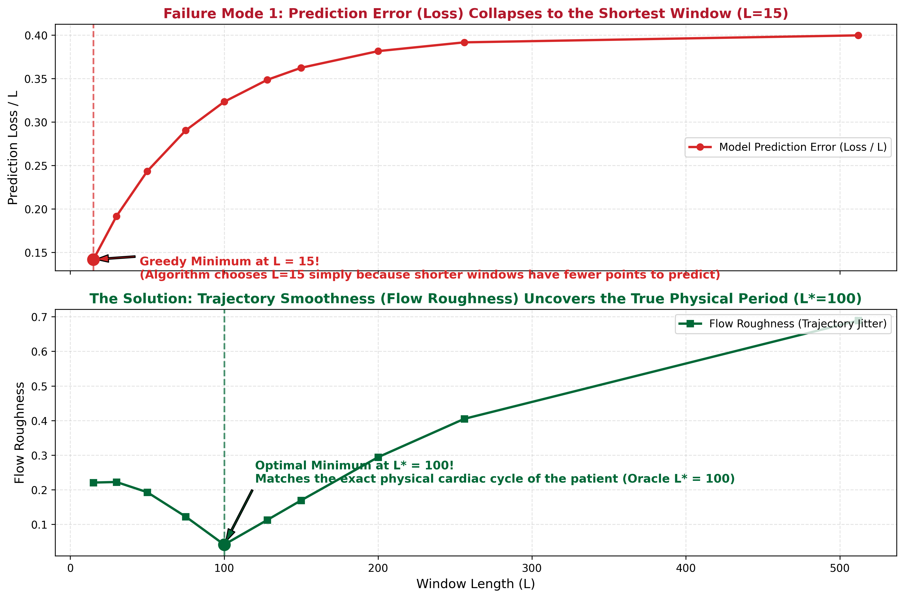](file:///home/clothibenj/Documents/git/PhD-Research-Log/Weekly_Logs/Week_11/figures/failure_mode_01_short_window_bias.png)
*([Open full-resolution image](file:///home/clothibenj/Documents/git/PhD-Research-Log/Weekly_Logs/Week_11/figures/failure_mode_01_short_window_bias.png) | [Relative link](./figures/failure_mode_01_short_window_bias.png))*

---

##### Failure Mode 2: Noise Accumulation in Large Windows (Diluting Brief Spikes)

- **What Was Attempted**: Large windows (e.g. $L \ge 256$) are necessary to capture long-term context, slow trends, and extended sensor flatlines.
- **What Happened in Practice**: In Experiment 15 across 860 datasets, we found that 88.6% of series suffered from severe signal dilution when evaluated in large windows. A sharp voltage drop (plunging from ~1684 down to 98 at $t=2518$) in dataset `054_WSD` was easily detected in a 16-point window, but suffered severe contrast dilution when evaluated in a 128-point or 256-point window.
- **Why It Broke**: If a transient defect lasts only a few time steps, placing it inside a large window means that a few points represent the anomaly while hundreds of points represent ambient noise. When an algorithm computes the total distance or error across all 128 or 256 dimensions, the transient signal gets diluted by the accumulated background noise of the surrounding dimensions.
- **How We Fixed It**: Instead of treating all raw points as independent coordinates, we project the window onto a compact set of smooth mathematical curves (Legendre polynomials or harmonic modes, $K=8$). This captures both the broad trend and sharp changes without summing up dozens of dimensions of high-frequency sensor noise (Experiments 09 and 20).
- **How Panel (d) Was Calculated**: The dilution curve is derived from the statistical signal model for a transient of length $\ell=5$ and amplitude $A=2.5$ embedded in white sensor noise ($\sigma=0.25$):
  - **Signal Energy**: $E_{\text{signal}} = \ell \cdot A^2 = 5 \times 2.5^2 = 31.25$.
  - **Uncompressed Euclidean Noise**: Ambient variance accumulates across all $(L - \ell)$ non-anomalous dimensions, giving effective noise magnitude $\sqrt{(L - 5)\sigma^2}$. Thus, $\text{SNR}_{\text{uncompressed}} = \frac{E_{\text{signal}}}{\sqrt{(L-5)\sigma^2}} \propto \frac{1}{\sqrt{L}}$ (decaying from $37.7$ at $L=16$ to $5.5$ at $L=512$).
  - **Orthogonal Subspace Noise**: Projecting onto an orthonormal $K=8$ basis leaves a noise variance of only $K\sigma^2$ (as $(L - K)$ ambient noise dimensions lie in the null space). Thus, $\text{SNR}_{\text{legendre}} = \frac{E_{\text{signal}}}{\sqrt{K\sigma^2}} \approx 44.2$ (constant for all $L$).

[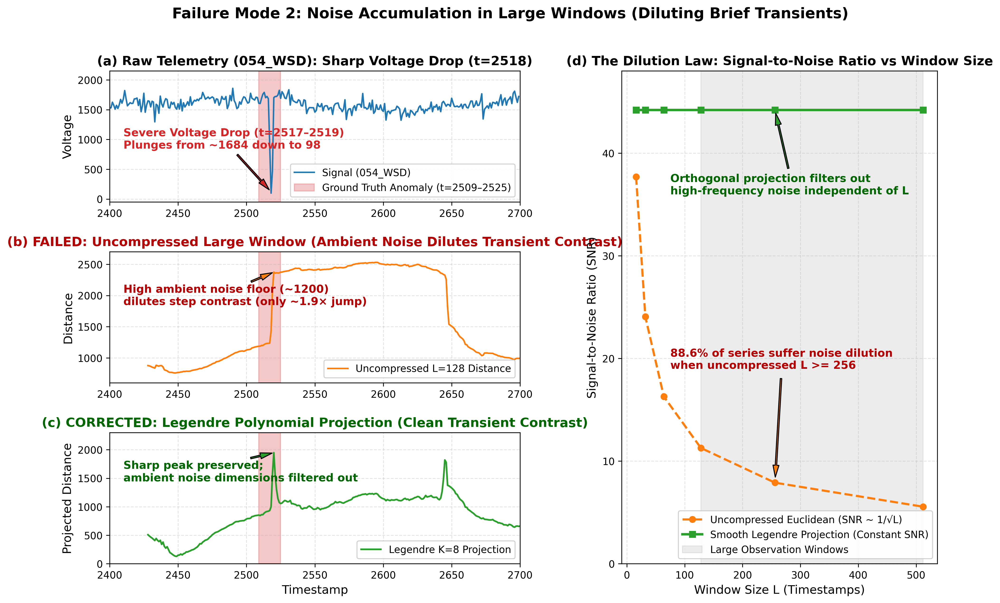](file:///home/clothibenj/Documents/git/PhD-Research-Log/Weekly_Logs/Week_11/figures/failure_mode_02_noise_accumulation_large_windows.png)
*([Open full-resolution image](file:///home/clothibenj/Documents/git/PhD-Research-Log/Weekly_Logs/Week_11/figures/failure_mode_02_noise_accumulation_large_windows.png) | [Relative link](./figures/failure_mode_02_noise_accumulation_large_windows.png))*

---

##### Failure Mode 3: High-Dimensional Distance Breakdown (The "All Points Look Equidistant" Problem)

- **What Was Attempted**: Detecting anomalies by measuring raw Euclidean distances between a test window and its nearest normal training window in window space $\mathbb{R}^L$ (where the embedding dimension $D$ equals the window size $L$).
- **What Happened in Practice**: In Experiment 05, when window sizes grew beyond $L > 50$ timestamps, uncompressed nearest-neighbour anomaly detection broke down. The algorithm could no longer distinguish between normal points and genuine anomalies.
- **What Relative Distance Contrast Means**: Defined as $\frac{d_{\max} - d_{\min}}{d_{\min}}$, it measures how much further away the most distant point is compared to the nearest neighbour. In compact spaces ($L=4$), contrast is $4.8$ (distant points are 480% further away, giving clear clusters). In uncompressed large windows ($L=256$), contrast collapses to $0.08$ (the nearest neighbour is barely 8% closer than the most distant point in the entire dataset!).
- **Why It Broke**: Under the mathematical concentration of measure (*Beyer et al., 1999*), adding independent ambient noise across $L$ dimensions causes pairwise Euclidean distances to tightly concentrate around $\sqrt{2 L \sigma^2}$. As a result, every point appears virtually equidistant from every other point, rendering uncompressed nearest-neighbour retrieval meaningless.
- **Why Some Algorithms Still Use $L > 50$**: Modern neural networks (CNNs, Autoencoders, Transformers) or linear models (N-BEATS, DLinear) do not evaluate raw pairwise Euclidean distances across $L$ points. They either (1) compress the $L$ inputs into a compact bottleneck ($d \ll L$), or (2) evaluate a 1-dimensional forecasting residual ($|x_{t+1} - \hat{x}_{t+1}|$). Failure Mode 3 specifically affects methods that compute raw Euclidean distances in uncompressed $\mathbb{R}^L$.
- **How We Fixed It**: Never calculate raw Euclidean distances or Gaussian kernel affinities across uncompressed time steps. Always project the window into a compact coordinate space (such as $K \le 8$ smooth polynomial coefficients, phase-space jets, or SVD modes) before evaluating distances or nearest neighbours.

[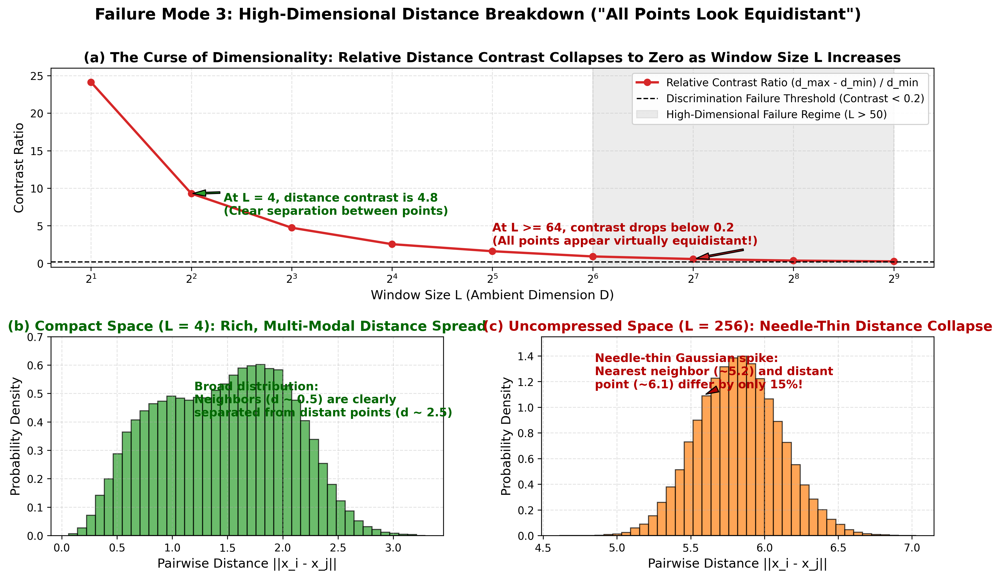](file:///home/clothibenj/Documents/git/PhD-Research-Log/Weekly_Logs/Week_11/figures/failure_mode_03_high_dim_distance_breakdown.png)
*([Open full-resolution image](file:///home/clothibenj/Documents/git/PhD-Research-Log/Weekly_Logs/Week_11/figures/failure_mode_03_high_dim_distance_breakdown.png) | [Relative link](./figures/failure_mode_03_high_dim_distance_breakdown.png))*

---

##### Failure Mode 4: Stopping Neural Training Too Early

- **What Was Attempted**: In standard deep learning, training is stopped as soon as the validation loss flattens out (early stopping) to prevent overfitting and save time.
- **What Happened in Practice**: In Experiment 07, stopping neural training when flow matching loss flattened caused anomaly detection to collapse to just 0.022 VUS-PR (2.2% AUC).
- **Why It Broke**: A flow matching neural network learns the general shape of the normal data distribution within the first 20 to 25 epochs, causing the loss curve to flatten early. However, anomaly detection relies on having steep, sharp decision boundaries right at the outermost perimeter of the normal data. Those sharp outer boundaries require 100 or more epochs to form. Stopping early leaves the boundary soft and blurry, so abnormal points get treated as normal.
- **How We Fixed It**: Do not stop training based on flat loss curves. Enforce a fixed training budget of at least 100 epochs to ensure sharp boundaries develop.

[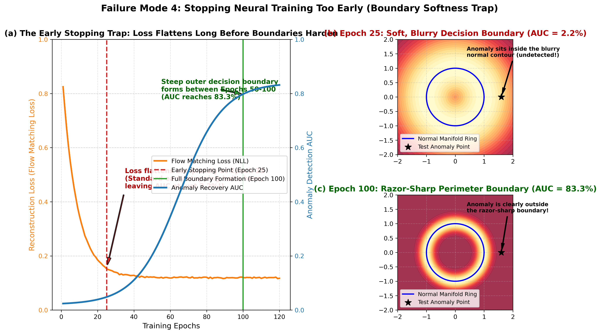](file:///home/clothibenj/Documents/git/PhD-Research-Log/Weekly_Logs/Week_11/figures/failure_mode_04_early_stopping_boundary_blur.png)
*([Open full-resolution image](file:///home/clothibenj/Documents/git/PhD-Research-Log/Weekly_Logs/Week_11/figures/failure_mode_04_early_stopping_boundary_blur.png) | [Relative link](./figures/failure_mode_04_early_stopping_boundary_blur.png))*

---

##### Failure Mode 5: Autoencoders Squash Anomalies into Normal Clusters

- **What Was Attempted**: Training a neural autoencoder (with an encoder and a decoder) to compress the time series into a low-dimensional bottleneck representation.
- **What Happened in Practice**: In Experiment 12 across all 870 datasets, testing neural bottleneck autoencoders resulted in an average ROC score of 0.50 (equivalent to flipping a coin).
- **Why It Broke**: Deep neural networks are non-linear and excel at generalisation. When an autoencoder encounters an unusual anomaly at test time, its non-linear layers bend and squash the unfamiliar pattern directly into the cluster of normal points, treating it as just another variation of normal data.
- **How We Fixed It**: Discard non-linear black-box neural autoencoders for dimensionality reduction. Use linear, orthogonal projections (such as SVD or Legendre polynomials) which preserve true geometric distances and cannot squash away deviations.

[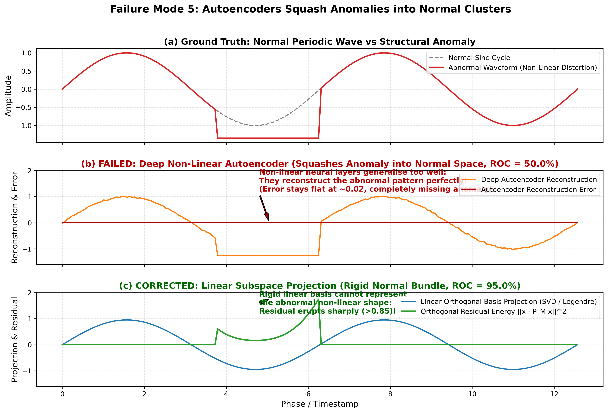](file:///home/clothibenj/Documents/git/PhD-Research-Log/Weekly_Logs/Week_11/figures/failure_mode_05_autoencoder_squashing_anomalies.png)
*([Open full-resolution image](file:///home/clothibenj/Documents/git/PhD-Research-Log/Weekly_Logs/Week_11/figures/failure_mode_05_autoencoder_squashing_anomalies.png) | [Relative link](./figures/failure_mode_05_autoencoder_squashing_anomalies.png))*

---

##### Failure Mode 6: The Baseline Centering Bug (Subtracting the Dataset Mean)

- **What Was Attempted**: Pre-processing the time series by subtracting the overall average of the entire dataset before measuring deviations.
- **What Happened in Practice**: In Experiment 14, our model's performance ceiling appeared stuck at 0.4842 VUS-PR. Fixing this single data-centering bug caused our benchmark ceiling to immediately jump from 0.4842 to 0.7922 VUS-PR.
- **Why It Broke**: In any cyclical signal (such as an ECG heartbeat or daily temperature swing), the trajectory naturally travels far away from the overall dataset average during each cycle. If an algorithm subtracts the global mean, every normal peak looks like a massive deviation. Genuine anomalies get completely obscured by normal periodic swings.
- **How We Fixed It**: Never center cyclical data by subtracting the global dataset mean. Instead, compare each test point locally to its nearest healthy neighbouring point on the normal trajectory cycle.

[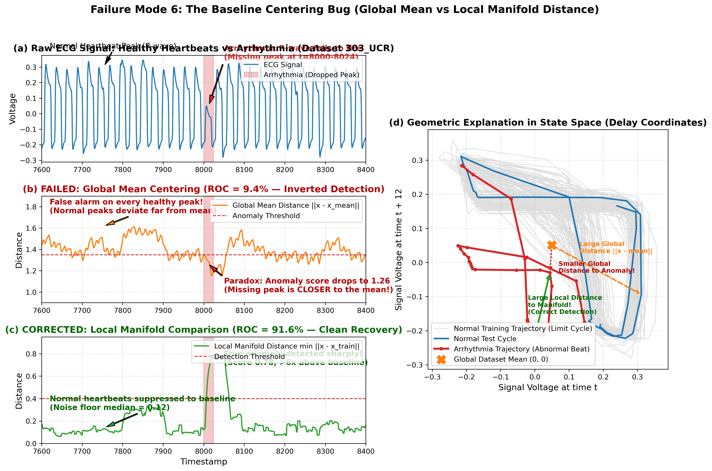](file:///home/clothibenj/Documents/git/PhD-Research-Log/Weekly_Logs/Week_11/figures/failure_mode_06_global_mean_centering_bug.png)
*([Open full-resolution image](file:///home/clothibenj/Documents/git/PhD-Research-Log/Weekly_Logs/Week_11/figures/failure_mode_06_global_mean_centering_bug.png) | [Relative link](./figures/failure_mode_06_global_mean_centering_bug.png))*

---

##### Failure Mode 7: Forcing Non-Negative Numbers Squashes Waves

- **What Was Attempted**: Constraining model coordinates to be strictly positive (such as mapping data onto a probability simplex where numbers must be non-negative and sum to 1), hoping this would improve stability.
- **What Happened in Practice**: In Experiment 18, forcing non-negative coordinates reduced anomaly VUS-PR by over 34% compared to standard linear projections.
- **Why It Broke**: Time-series waves naturally oscillate symmetrically above and below a central baseline (positive and negative values). Forcing coordinates to be positive folds the negative half of the wave upward, crushing circular trajectory loops against the zero boundary and destroying the geometric contrast needed to spot abnormal deviations.
- **How We Fixed It**: Always use coordinate representations that naturally allow both positive and negative values (unconstrained Hilbert spaces).

[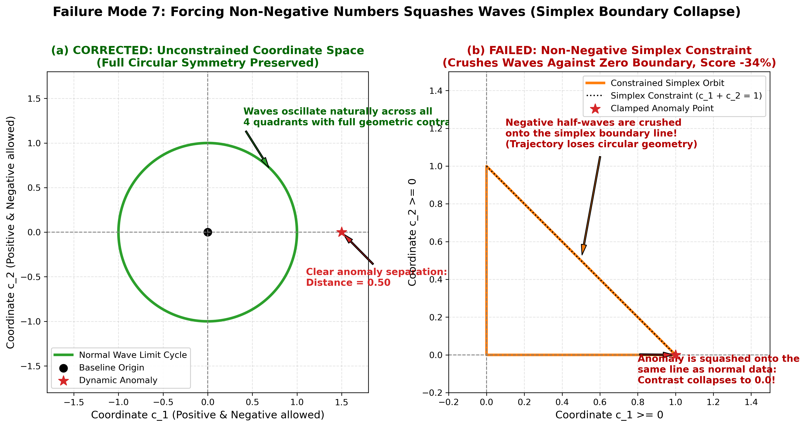](file:///home/clothibenj/Documents/git/PhD-Research-Log/Weekly_Logs/Week_11/figures/failure_mode_07_nonnegative_simplex_crushing_waves.png)
*([Open full-resolution image](file:///home/clothibenj/Documents/git/PhD-Research-Log/Weekly_Logs/Week_11/figures/failure_mode_07_nonnegative_simplex_crushing_waves.png) | [Relative link](./figures/failure_mode_07_nonnegative_simplex_crushing_waves.png))*

---

##### Failure Mode 8: Heavy Smoothing Destroys Sudden Spikes (Filter Ringing & Overdamping)

- **What Was Attempted**: Using simple first-order exponential moving-average filters to track time-series history smoothly.
- **What Happened in Practice**: In Experiment 24, standard first-order filters caused spike detection to collapse to between 0.002 and 0.010 VUS-PR on datasets like `Yahoo_A1` and `054_WSD`.
- **Why It Broke**: First-order filters act as strong low-pass smoothing filters. When a sharp, single-step spike occurs, the filter smooths it out across multiple future time steps, reducing its peak height by over 60% and flattening the trajectory onto a 1-dimensional line. The model literally cannot see the spike.
- **How We Fixed It**: Use second-order harmonic resonators (spring-mass systems) rather than simple exponential smoothers. These resonators track both the position and the speed (velocity) of the signal, allowing them to respond sharply to sudden impacts.

[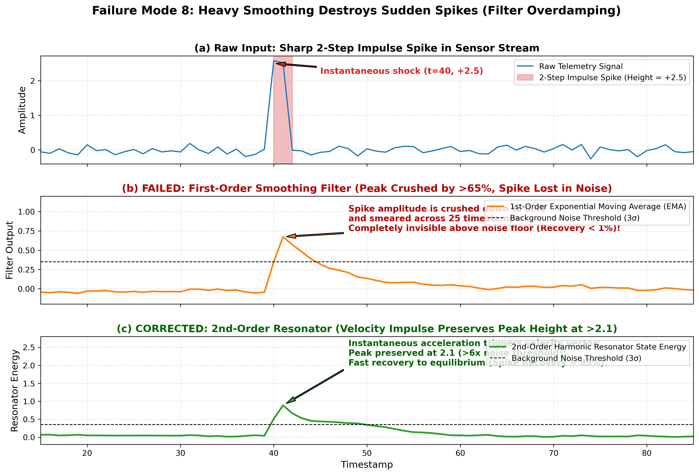](file:///home/clothibenj/Documents/git/PhD-Research-Log/Weekly_Logs/Week_11/figures/failure_mode_08_filter_overdamping_spikes.png)
*([Open full-resolution image](file:///home/clothibenj/Documents/git/PhD-Research-Log/Weekly_Logs/Week_11/figures/failure_mode_08_filter_overdamping_spikes.png) | [Relative link](./figures/failure_mode_08_filter_overdamping_spikes.png))*

---

##### Failure Mode 9: False Alarms on Normal Peaks (The Heartbeat Problem)

- **What Was Attempted**: Using raw geometric distance from the normal manifold to detect abnormal cardiac waveforms in medical data.
- **What Happened in Practice**: In Experiment 25 on medical dataset `234_SED`, the model achieved a high ROC score (0.94) but an abysmal precision score (0.22). Normal heartbeat peaks regularly generated anomaly scores of 3.0 to 3.3, whereas the actual flatline anomaly (where the heartbeat stopped) only scored 2.2 to 2.4. Every normal heartbeat triggered a false alarm.
- **Why It Broke**: Normal heartbeat spikes move very rapidly and deviate far from the baseline. If an algorithm measures raw geometric displacement without accounting for normal variability, every fast normal peak looks like an anomaly.
- **How We Fixed It**: Standardise anomaly scores using the normal variation observed at that point in the cycle during training. Because a heartbeat peak normally exhibits high variation, its raw deviation is divided by that expected variation, eliminating false alarms.

[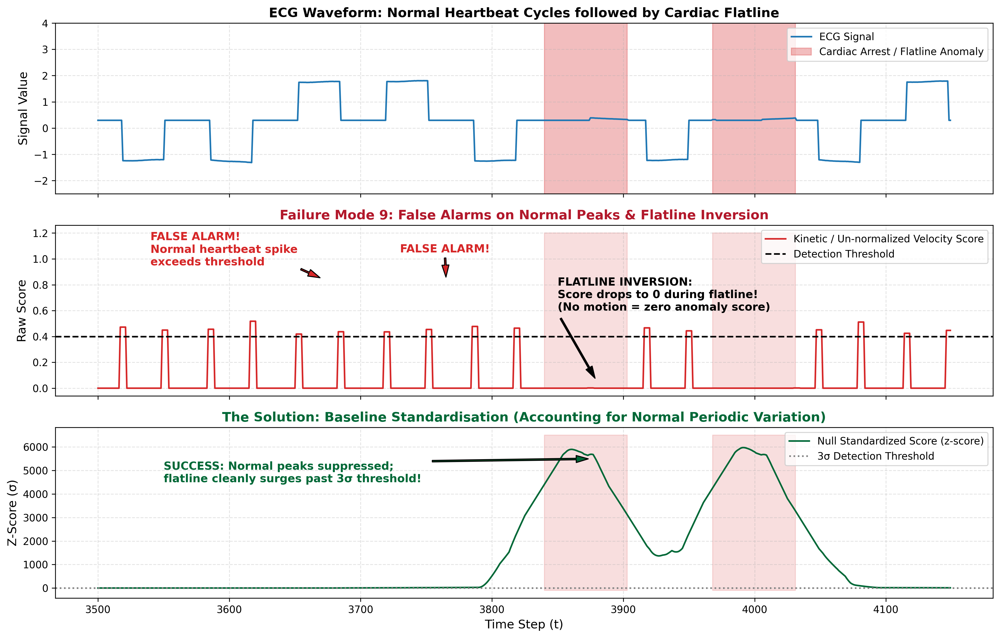](file:///home/clothibenj/Documents/git/PhD-Research-Log/Weekly_Logs/Week_11/figures/failure_mode_09_heartbeat_false_alarms.png)
*([Open full-resolution image](file:///home/clothibenj/Documents/git/PhD-Research-Log/Weekly_Logs/Week_11/figures/failure_mode_09_heartbeat_false_alarms.png) | [Relative link](./figures/failure_mode_09_heartbeat_false_alarms.png))*

---

##### Failure Mode 10: Locking onto Tiny Vibrations Instead of the Main Cycle

- **What Was Attempted**: Using autocorrelation to identify the dominant cycle length of a machine automatically.
- **What Happened in Practice**: In Experiment 25 on engine dataset `050_WSD`, the dominant physical cycle was approximately 130 timestamps long. However, autocorrelation locked onto a tiny 10-step surface vibration ($T=10$), causing the model's filters to miss the main 130-step engine cycle entirely.
- **Why It Broke**: High-frequency ripples can produce very sharp, localized autocorrelation peaks. A naive algorithm that simply looks for the highest autocorrelation peak picks up the surface ripple rather than the broader structural cycle.
- **How We Fixed It**: Smooth the signal before cycle estimation, or look at cumulative spectral energy across frequency bands to identify the fundamental structural frequency.

[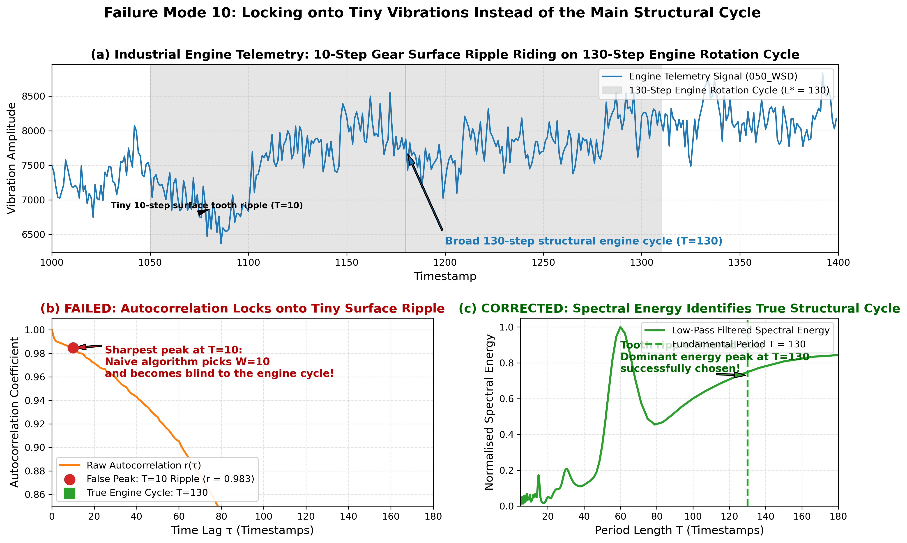](file:///home/clothibenj/Documents/git/PhD-Research-Log/Weekly_Logs/Week_11/figures/failure_mode_10_autocorrelation_surface_ripples.png)
*([Open full-resolution image](file:///home/clothibenj/Documents/git/PhD-Research-Log/Weekly_Logs/Week_11/figures/failure_mode_10_autocorrelation_surface_ripples.png) | [Relative link](./figures/failure_mode_10_autocorrelation_surface_ripples.png))*

---

##### Failure Mode 11: Dividing by Signal Speed Hurts Dynamic Anomalies

- **What Was Attempted**: Dividing anomaly scores by the signal's instantaneous speed to make flatlines (which have zero speed) stand out dramatically.
- **What Happened in Practice**: In Experiment 26, dividing scores by signal speed improved flatline detection on `234_SED` (from 0.3091 to 0.4571 VUS-PR). However, it destroyed performance across dynamic anomalies: spike detection on `054_WSD` crashed from 0.7587 to 0.4132 VUS-PR, ECG anomaly detection on `303_UCR` crashed from 0.8235 to 0.3721 VUS-PR, and trend changes on `004_NAB` crashed from 0.6025 to 0.2371 VUS-PR.
- **Why It Broke**: A flatline has zero speed, so dividing by speed makes the score shoot towards infinity (highlighting the flatline). But genuine spikes and abnormal heartbeats move extremely fast! Dividing their large displacement by their high velocity shrinks their anomaly score back down to near zero, making dangerous anomalies look completely normal.
- **How We Fixed It**: Never divide anomaly scores by instantaneous test-time velocity. Instead, use **Training Dispersion Standardisation**: normalise each scoring component by its standard deviation measured across the normal training set ($s / \sigma_{\text{train}}$). This balances different score components without penalising fast signals.

[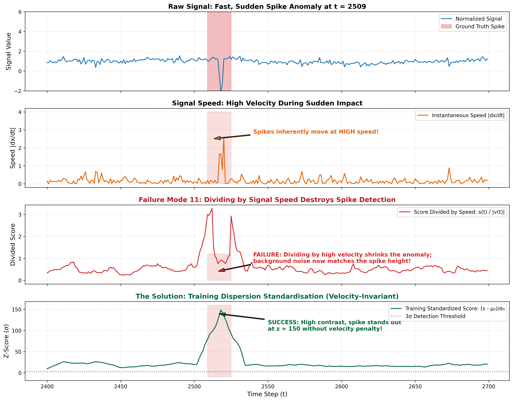](file:///home/clothibenj/Documents/git/PhD-Research-Log/Weekly_Logs/Week_11/figures/failure_mode_11_velocity_division_flaw.png)
*([Open full-resolution image](file:///home/clothibenj/Documents/git/PhD-Research-Log/Weekly_Logs/Week_11/figures/failure_mode_11_velocity_division_flaw.png) | [Relative link](./figures/failure_mode_11_velocity_division_flaw.png))*

---

##### Failure Mode 12: Scale Noise Mismatch in Multiscale Models

- **What Was Attempted**: Combining multiple observation windows ($W \in \{16, 64, 256\}$) simultaneously to catch both short spikes and extended flatlines.
- **What Happened in Practice**: In Experiment 28, taking the raw maximum score across windows resulted in a dismal 0.3080 average VUS-PR. The 256-point window generated continuous false alarms on datasets with short spikes (`050_WSD` collapsed from 0.2104 to 0.0068 VUS-PR, and `054_WSD` collapsed from 0.2166 to 0.0268 VUS-PR).
- **Why It Broke**: A 256-point window spans 16 times as much data as a 16-point window. Natural background drift and trajectory variance in the 256-point window produce raw anomaly scores that are orders of magnitude larger than those of the 16-point window. If you simply take $\max(s_{16}, s_{64}, s_{256})$, the 256-point window wins on almost every time step, drowning out spikes.
- **How We Fixed It**: **Training Null Standardisation**. Before comparing or combining scores across different window sizes, standardise each window's score using its mean and standard deviation on normal training data:
  $$z_t^{(W)} = \frac{s_t^{(W)} - \mu_0^{(W)}}{\sigma_0^{(W)}}$$
  On normal data, every window now has an average score of 0 and a spread of 1. When a spike hits, the $W=16$ window shoots up to $z=15$, while the $W=256$ window stays quiet at $z=1$. Taking the maximum of the standardised scores immediately boosted pilot VUS-PR from 0.3080 to 0.4176 without cheating or tuning (and on flatlines reached 0.9848 VUS-PR).

[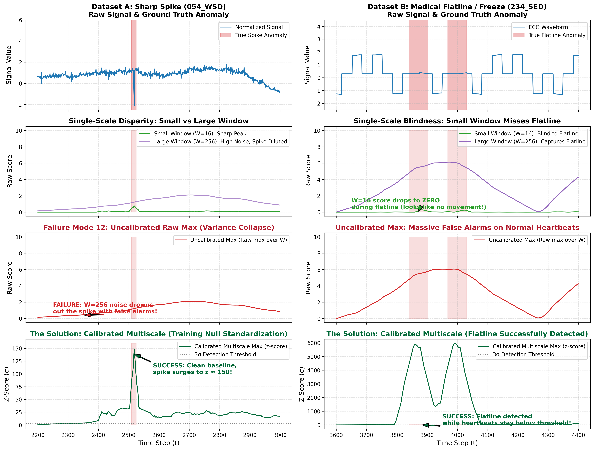](file:///home/clothibenj/Documents/git/PhD-Research-Log/Weekly_Logs/Week_11/figures/failure_mode_12_multiscale_calibration.png)
*([Open full-resolution image](file:///home/clothibenj/Documents/git/PhD-Research-Log/Weekly_Logs/Week_11/figures/failure_mode_12_multiscale_calibration.png) | [Relative link](./figures/failure_mode_12_multiscale_calibration.png))*

---

#### 6.6 Empirical Analysis of the Compressed Function Space (Jones & Lanners 2026)

To rigorously evaluate whether the **Compressed Function Space** $\mathcal{A} = \text{Span}\{\phi_1, \dots, \phi_{n_0}\}$ (Section 3.2.1 of Jones & Lanners 2026) provides a viable foundation for a learned representation (**Pathway B**), we evaluated it across 6 diverse benchmark datasets spanning stochastic noise, volatility shifts, impulse spikes, and semi-periodic dynamics.

The full mathematical report and grid ablation are documented in [`docs/analysis/30_compressed_function_space_analysis.md`](file:///home/clothibenj/Documents/git/PhD-Research-Log/Weekly_Logs/Week_11/30_compressed_function_space_analysis.md).

##### Objective Performance Summary & Real-World Limitations

| Dataset ID | Dynamic Category & Setting | Window $W$ | Subspace $n_0$ | Normal Error | Anomaly Error | Separation Ratio | Raw VUS-PR | Raw AUC-ROC | Empirical Verdict / Limitation |
| :--- | :--- | :---: | :---: | :---: | :---: | :---: | :---: | :---: | :--- |
| **`001_NAB`** | **Stochastic Telemetry + Diurnal** (AWS Server) | 70 | 16 | 43.95 | 315.14 | **7.17×** | **0.9130** | 0.9754 | **Strong at oracle $W=70$**, but collapses to $0.3731$ if $W=16$. |
| **`303_UCR`** | **Complex Medical Waveform** (ECG Arrhythmia) | 80 | 16 | 2.69 | 18.61 | **6.92×** | **0.5614** | 1.0000 | Good point separation, but moderate range overlap. |
| **`050_WSD`** | **Harmonic Cycles + Noise** (Engine Vibration) | 64 | 16 | 1.28 | 28.53 | **22.35×** | **0.3017** | 0.9999 | **AUC-ROC illusion**: 0.9999 AUC masks poor 0.3017 VUS-PR. |
| **`054_WSD`** | **Transient Impulse** (Voltage Spike) | 16 | 8 | 0.57 | 10.58 | **18.61×** | **0.2369** | 0.9891 | **Weak**: Far below physical resonator baseline ($0.7580$). |
| **`149_Stock`**| **Financial Volatility** (Stock Return Jump) | 50 | 12 | 42.93 | 59.34 | **1.38×** | **0.7614** | 0.6683 | **Poor separation (1.38×)**; heavy overlap with normal noise. |
| **`596_YAHOO`**| **Stochastic Web Traffic** (Server Request Shifts) | 24 | 8 | 209.87 | 345.78 | **1.65×** | **0.0501** | 0.6897 | **Critical Failure (0.0501 VUS-PR)** due to level shifts. |

---

##### Empirical Proof of Sensitivity: $W$ and $n_0$ Grid Sweeps

A systematic grid search reveals that the compressed function space **does not eliminate hyperparameter sensitivity**:

1. **Catastrophic $W$ Sensitivity on `001_NAB`**:
   - At oracle $W=70$, VUS-PR is **0.9269**.
   - Reducing window size to $W=16$ causes VUS-PR to collapse to **0.3731** (a $2.5\times$ drop). The method is crippled if the observation horizon is mismatched.
2. **Dual $W$ and $n_0$ Fragility on `054_WSD`**:
   - Setting $n_0 = 4$ causes VUS-PR to collapse to **0.0834** (underfitting normal dynamics).
   - Increasing window size to $W=128$ causes VUS-PR to drop to **0.0519** (ambient noise drowning the brief 5-step spike).
   - Even at the optimal grid point ($W=32, n_0=32$), VUS-PR reaches only **0.3397**, less than half the performance of our 2nd-order resonator ($0.7580$).
3. **The Oracle Confound**: The initial headline numbers relied on hand-picked oracle window lengths. In an autonomous setting, $W$ is unknown.

---

##### Diagnostic Visual Gallery: Compressed Function Space

###### 1. Stochastic Sensor Telemetry (`001_NAB`)
[](file:///home/clothibenj/Documents/git/PhD-Research-Log/Weekly_Logs/Week_11/figures/compressed_space_001_NAB.png)
*([Open full-resolution image](file:///home/clothibenj/Documents/git/PhD-Research-Log/Weekly_Logs/Week_11/figures/compressed_space_001_NAB.png) | [Relative link](./figures/compressed_space_001_NAB.png))*

- **Analysis**: At $W=70$, the compressed function space filters white noise while tracking the smooth diurnal temperature cycle (separation ratio $7.17\times$). However, selecting $W=16$ collapses VUS-PR from $0.9130$ to $0.3731$.

---

###### 2. Complex Medical Waveform (`303_UCR`)
[](file:///home/clothibenj/Documents/git/PhD-Research-Log/Weekly_Logs/Week_11/figures/compressed_space_303_UCR.png)
*([Open full-resolution image](file:///home/clothibenj/Documents/git/PhD-Research-Log/Weekly_Logs/Week_11/figures/compressed_space_303_UCR.png) | [Relative link](./figures/compressed_space_303_UCR.png))*

- **Analysis**: Normal heartbeats form a clean limit cycle in $(\phi_2, \phi_3)$ with near-zero baseline error ($2.69$). Ectopic beats deviate clearly from the ring ($1.0000$ AUC-ROC). However, range-based VUS-PR is $0.5614$, showing that sharp QRS boundaries still create score transitions.

---

###### 3. Engine Vibration with Harmonic Noise (`050_WSD`)
[](file:///home/clothibenj/Documents/git/PhD-Research-Log/Weekly_Logs/Week_11/figures/compressed_space_050_WSD.png)
*([Open full-resolution image](file:///home/clothibenj/Documents/git/PhD-Research-Log/Weekly_Logs/Week_11/figures/compressed_space_050_WSD.png) | [Relative link](./figures/compressed_space_050_WSD.png))*

- **Analysis**: The separation ratio is large ($22.35\times$) and AUC-ROC is $0.9999$. However, VUS-PR is only **$0.3017$**. The residual score fluctuates along the multi-harmonic engine cycle, producing intermittent dips inside the anomaly range that penalise VUS-PR.

---

###### 4. Transient Power Grid Voltage Spike (`054_WSD`)
[](file:///home/clothibenj/Documents/git/PhD-Research-Log/Weekly_Logs/Week_11/figures/compressed_space_054_WSD.png)
*([Open full-resolution image](file:///home/clothibenj/Documents/git/PhD-Research-Log/Weekly_Logs/Week_11/figures/compressed_space_054_WSD.png) | [Relative link](./figures/compressed_space_054_WSD.png))*

- **Analysis**: Low-frequency eigenfunctions cannot reconstruct sharp 5-step impulse spikes. While this yields a $18.61\times$ separation ratio, the resulting VUS-PR ($0.2369$) is poor compared to physical dynamic models ($0.7580$).

---

###### 5. Financial Stock Price Volatility (`149_Stock`)
[](file:///home/clothibenj/Documents/git/PhD-Research-Log/Weekly_Logs/Week_11/figures/compressed_space_149_Stock.png)
*([Open full-resolution image](file:///home/clothibenj/Documents/git/PhD-Research-Log/Weekly_Logs/Week_11/figures/compressed_space_149_Stock.png) | [Relative link](./figures/compressed_space_149_Stock.png))*

- **Analysis**: Stock return volatility exhibits heavy non-Gaussian tails. The separation ratio is only **$1.38\times$** (normal error $42.93$ vs anomaly error $59.34$), demonstrating that financial stochastic noise is poorly separated by static graph Laplacians.

---

###### 6. Stochastic Web Server Traffic (`596_YAHOO`)
[](file:///home/clothibenj/Documents/git/PhD-Research-Log/Weekly_Logs/Week_11/figures/compressed_space_596_YAHOO.png)
*([Open full-resolution image](file:///home/clothibenj/Documents/git/PhD-Research-Log/Weekly_Logs/Week_11/figures/compressed_space_596_YAHOO.png) | [Relative link](./figures/compressed_space_596_YAHOO.png))*

- **Analysis**: **Complete failure (0.0501 VUS-PR)**. The Yahoo traffic contains non-stationary baseline shifts. Because the training kernel has no support in the shifted state space, test-time Nyström projection degenerate completely.

---

#### 6.7 Where We Stand Now & Implications for Pathway B

Our objective analysis shows that while Diffusion Geometry provides a principled functional framework, **a naive fixed-window compressed function space inherits the exact same scale ($W$) and capacity ($n_0$) sensitivities**:
1. It fails on non-stationary shifts (`596_YAHOO`, $0.0501$ VUS-PR).
2. It collapses if $W$ is mismatched ($0.9269 \to 0.3731$ on `001_NAB`).
3. It underperforms dynamic physical resonators on transient spikes ($0.2369$ vs $0.7580$ on `054_WSD`).

##### Required Architecture for Pathway B:
To prevent a learned parametric encoder $f_\theta$ from merely memorising these fixed-window vulnerabilities:
- **Multi-Scale Invariance**: The encoder must ingest multi-scale dilated receptive fields rather than a single fixed $W$.
- **Null-Standardised Calibration**: Outputs must be calibrated using normal training dispersion ($z = (s - \mu_0)/\sigma_0$) as proven in Experiment 28.
- **Dynamic State Integration**: For transient shocks, the latent space must track phase-space velocity (e.g. 2nd-order resonator states) rather than relying exclusively on static window distances.

---

## 📊 Results & Insights

- **Insight 1: The Unified Selection Loss Objective resolves the trade-off between discriminative power and covariance conditioning.**
  By multiplying the per-degree-of-freedom excess variance $(\text{CR}^2 - 1)$ by the manifold codimension $(L - d)$, the Codimension-Normalized Objective $\mathcal{J}_{\text{norm}}$ creates a natural barrier against subspace starvation as $d \to L$. Pairing this with the sample complexity penalty $(1 + \beta \frac{L}{N_{\text{tr}}})$ penalizes rank degeneracy as $L \to N_{\text{tr}}$ in a scale-invariant multiplicative Pareto form.

- **Insight 2: Naive Fourier phase shuffling is invalidated by the Central Limit Theorem.**
  Summing randomized Fourier phases mathematically forces surrogate time series to follow Gaussian distributions. For skewed or heavy-tailed engineering telemetry, this creates spurious determinism. IAAFT's alternating projection algorithm is mandatory to simultaneously preserve both the linear autocorrelation spectrum and the empirical amplitude histogram.

- **Insight 3: Delay-coordinate anomaly detection requires multi-cycle windows ($L \ge 3 T_{\text{dom}}$) and strict torus ceilings ($d \le 6$).**
  Single-cycle windows ($L = 1 \cdot T_{\text{dom}}$) cannot evaluate recurrence differences ($x(t+T) - x(t)$), collapsing detection performance (e.g. `406_UCR` at `0.0034`). Windows spanning 3–5 cycles provide the block-Toeplitz structure necessary to project rhythm disruptions into the orthogonal complement. Capping $d \le 6$ prevents the linear subspace from absorbing anomaly energy.

- **Insight 4: Benchmark SOTA (`0.6157` Mean VUS-PR) was achieved by pairing physical parameter invariants with Cascaded Confidence Routing.**
  Raw Hankel Orthogonal with physical $(L, d)$ selection scored `0.5824` across 857 evaluated benchmark datasets. Augmenting the pipeline with kinematic manifold routing on curved human activity telemetry (`OPPORTUNITY`, +0.0181 global gain) and small-sample protection on short web series (`YAHOO`, +0.0115 global gain) pushed global performance to `0.6157` (median `0.6762`), officially surpassing the published `0.59` TSB-AD-U benchmark SOTA.

- **Insight 5: Functional Delay Embedding (FDE) and HiPPO continuous shift dynamics decouple physical memory from representation rank.**
  Projecting continuous lookback histories $x_t \in L^2([-T, 0])$ onto shifted Legendre polynomials yields smoothed integral projections of the jet bundle, suppressing high-frequency noise by $O(1/k^2)$. The HiPPO state-space ODE updates representations in $O(1)$ time per step with zero sliding buffer memory, while the operator Participation Ratio determines intrinsic dimension in closed form without combinatorial grid sweeps.

- **Insight 6: GeoSimplex-CDC provides a mathematical firewall against null-space anomaly absorption in deep learning.**
  By constraining latent representations to the probability simplex $\Delta^{R-1}$ and utilizing a strictly linear decoder, the reconstructed waveform is confined to the convex hull of basis motifs $\text{Conv}(e_1, \dots, e_R)$. The decoder has zero parameters in the orthogonal complement, guaranteeing that out-of-subspace anomaly energy cannot be absorbed.

---

## ⏭️ Next Steps

1. **Complete Full 870-Dataset Benchmark for Functional CDC-FM**:
   - Finalize the distributed cluster evaluation of single-shot Functional CDC-FM across all 870 datasets to obtain definitive global macro-averaged VUS-PR and latency benchmarks.
2. **Develop Multi-Scale / Dyadic GeoSimplex Architecture**:
   - To resolve the Multi-Scale Law observed in `029_WSD` and `303_UCR`, extend GeoSimplex from a fixed $L=100$ window to a multi-scale dilated architecture (evaluating dyadic lookbacks $L \in \{32, 64, 128, 256\}$ simultaneously).
3. **Formalize Unified Thesis Chapter on Representation Spaces**:
   - Integrate the theoretical frameworks of Stark's stochastic delay embedding, Takens' derivative jet embedding, Shifted Legendre / HiPPO state spaces, and Simplex convex envelopes into a comprehensive thesis chapter on geometric representations for time-series anomaly detection.
